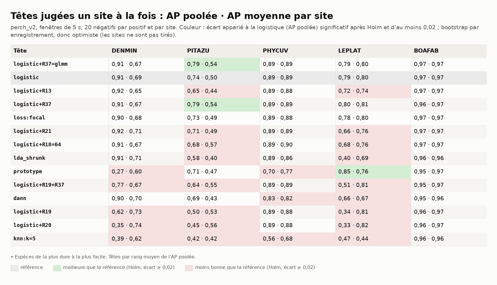
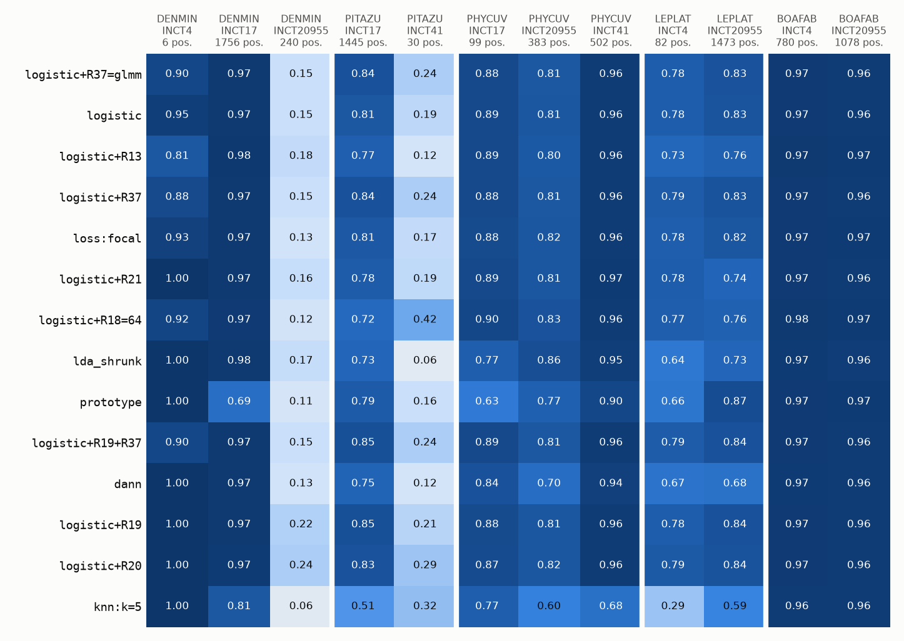
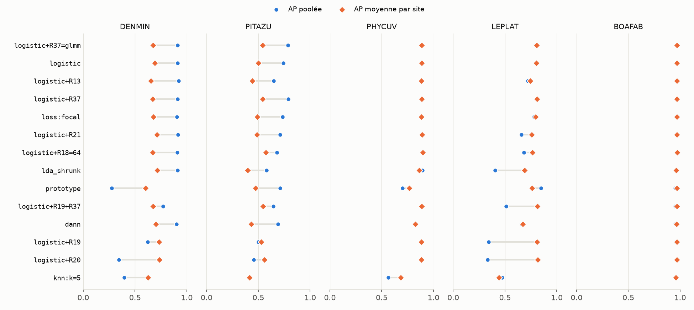

# Benchmark 01 — Têtes et régularisations sur AnuraSet, un site à la fois (perch_v2)

28/09/2026 · commit `32d4832` + stock complété (n° 141) · statut : **indicateur** (d'autres
anoures qu'A. blanci ; 2 à 3 sites par espèce).

## En bref

- **La logistique reste la tête à battre** d'un site à l'autre. Le kNN s'effondre sur 4
  espèces sur 5, le prototype sur 2 (il gagne sur LEPLAT) : amorcer un site avec des exemples
  venus d'ailleurs ne suffit pas.
- **R37 (biais par site, σ fixé ou GLMM)** est la seule régularisation qui gagne nettement,
  sur PITAZU (+0,05 d'AP poolée, meilleure sur ses deux sites tenus à l'écart). Ailleurs :
  neutre.
- **R19 et R20 classent mieux à l'intérieur d'un site, mais cassent la comparaison entre
  sites** — là, et seulement là, où l'espèce occupe 26 à 41 % des fenêtres du site. A. blanci
  étant rare, ce mécanisme devrait peu peser sur nos données : à vérifier.
- **Le seuil ne voyage pas** : choisi sur les autres sites, le rappel à précision 0,5 de
  PITAZU tombe à 0,01 (0,92 avec un seuil choisi sur place). Un nouveau site demandera son
  propre seuil.
- La recalibration de chaque pli (n° 135) dégrade l'AP poolée : elle reste coupée.

## 1. Question

Parmi les têtes et régularisations programmées, lesquelles **généralisent à un site jamais vu**
— le cœur du projet — sur des anoures néotropicaux proches de notre cas ?

## 2. Données

| | |
|---|---|
| Jeu | AnuraSet (Cañas et al. 2023, Zenodo 8342596, CC BY) : 1 612 enregistrements d'une minute, 4 sites du Brésil, 42 espèces, chants datés |
| Retenus | 1 599 enregistrements : 1 206 aux chants datés + 393 sans aucune espèce (vrais négatifs, labels faibles). Écartés : 13 qui signalent une espèce sans chant daté |
| Fenêtres | 19 166 fenêtres de 5 s jointives |
| Espèces | les 5 présentes sur au moins 2 sites (figure 1) |


*Figure 1 — Fenêtres positives de chaque espèce, par site. Une seule espèce (BOAFAB) est
équilibrée ; PITAZU et LEPLAT ont un site presque vide (30 et 82 fenêtres).*

## 3. Pipeline et choix

| Étape | Choix | Pourquoi |
|---|---|---|
| Enregistrements | chants datés + fichiers sans espèce ; aucun filtre qualité | les fichiers sans espèce sont les seuls négatifs sûrs ; la durée attendue (60 s) est celle des Song Meter ONF, pas d'AnuraSet (n° 141) |
| Encodeur | perch_v2 (bacpipe 1.3.5, ONNX, CPU) | meilleur candidat du §2 ; un seul encodeur ici |
| Fenêtres | 5 s, jointives | moitié moins d'encodage (37 min) ; les chants coupés par une jonction gardent la fenêtre qui en porte la plus grande part (n° 138) |
| Labels | positive = contient un chant entier de l'espèce (ou sa plus grande part) ; fichiers où l'espèce est signalée sans chant daté : écartés pour elle | pas de positifs cachés parmi les négatifs (n° 138) |
| Négatifs | 20 par positif et par site, tirés au hasard | même ratio que le benchmark ONF |
| Plis | un pli par site (leave-one-site-out) ; C (0,001 à 10) et σ du GLMM (0,3 ; 1 ; 3) choisis par plis internes, eux aussi par site | mesure la généralisation à un site jamais vu, pas à un micro voisin |
| Têtes | 14 (`anuraset.CAMPAIGN_HEADS`) : référence, similarité, fond du site (R19–R21, DANN), biais (R37), déséquilibre (R13, focal), ACP (R18), LDA | une question par groupe (n° 136) |
| Métriques | AP poolée (tous les sites ensemble) **et** AP par site tenu à l'écart ; rappel à précision 0,5 au seuil choisi sur les autres sites | l'AP poolée juge aussi l'échelle commune des scores ; l'AP par site juge le classement seul (n° 133) |
| Comparaisons | écart apparié à la logistique, bootstrap par enregistrement, correction de Holm sur 65 comparaisons | optimiste : avec 2 à 3 sites, on ne peut pas tirer les sites ; l'AP par site sert de contrôle (n° 139) |

## 4. Résultats



*Figure 2 — AP poolée · AP moyenne par site. En couleur : écart à la logistique significatif
(Holm) et d'au moins 0,02.*



*Figure 3 — AP de chaque tête sur chaque site tenu à l'écart. Les colonnes pâles sont les cas
durs : DENMIN à INCT20955 (≤ 0,24 pour toutes les têtes), PITAZU à INCT41 (≤ 0,42).*



*Figure 4 — Un grand écart entre les deux marqueurs signale des sites sur des échelles
différentes : R19, R20 sur DENMIN, PITAZU, LEPLAT.*

Rappel à précision 0,5, seuil choisi sur les autres sites (entre parenthèses : seuil choisi
sur place, optimiste) :

| Tête | DENMIN | PITAZU | PHYCUV | LEPLAT | BOAFAB |
|---|---|---|---|---|---|
| logistic | 0,89 (0,92) | **0,01** (0,92) | 0,91 (0,92) | 0,59 (0,87) | 0,99 (0,99) |
| logistic+R37 | 0,89 (0,92) | **0,01** (0,95) | 0,90 (0,92) | 0,72 (0,89) | 0,99 (0,99) |
| logistic+R19 | 0,39 (0,56) | 0,02 (0,85) | 0,91 (0,92) | 0,05 (0,04) | 0,98 (0,99) |

## 5. Hypothèses

1. **Similarité contre logistique.** Le plus proche voisin d'une fenêtre d'un nouveau site est
   d'abord un fond qui lui ressemble ; la logistique apprend les directions qui séparent le
   chant du fond sur plusieurs sites. Exception : LEPLAT, où le prototype gagne en AP poolée
   (0,85 contre 0,79) — appris sur 82 positifs seulement quand INCT20955 est tenu à l'écart,
   une moyenne résiste peut-être mieux qu'une frontière apprise.
2. **R19, R20.** Le centrage par site retranche la moyenne de toutes les fenêtres du site. Là
   où l'espèce est partout (DENMIN : 41 % des fenêtres d'INCT17 ; PITAZU : 34 % ; LEPLAT :
   26 % d'INCT20955), cette moyenne contient le chant : tout le site perd une part de son
   signal, ses scores baissent d'un bloc, le classement entre sites se brise ; dans le site, le
   fond retiré aide. Là où l'espèce est rare (PHYCUV, 2 à 12 %), rien ne casse. Test direct :
   centrer sur les seuls enregistrements sans espèce.
3. **R37 sur PITAZU.** Les deux sites ont des proportions de positifs sans commune mesure
   (34 % contre 0,7 %) ; le biais par site absorbe ce niveau pendant l'apprentissage, les
   poids restent sur le chant : meilleur sur les deux sites tenus à l'écart (0,84 contre 0,81 ;
   0,24 contre 0,19).
4. **Cas durs.** DENMIN à INCT20955 : 64 % de chants de faible qualité (35 % à INCT17) et
   4 % de fenêtres positives, appris presque seulement sur INCT17 — des chants lointains
   qu'aucune tête n'a vus. PITAZU à INCT41 : 30 positives ; l'ACP (R18=64) y double l'AP
   (0,42 contre 0,19), sans doute en limitant ce que la tête apprend de propre à INCT17.
5. **Seuil.** Les scores d'un site sont décalés d'un bloc par rapport à un autre (fond,
   proportion de chant) : un seuil appris ailleurs tombe à côté. C'est aussi pourquoi la
   recalibration par pli, apprise sur d'autres sites, dégrade l'AP poolée (annexe B).

## 6. Ce qu'on en retient pour A. blanci

- Garder la **logistique** comme référence ; tester **R37** sur les données ONF (sites aux
  proportions de positifs très différentes : notre cas).
- **R19, R20** : ne pas les écarter sur la foi d'AnuraSet (espèces bien plus abondantes
  qu'A. blanci) ; les juger sur les données ONF, site par site et en AP poolée.
- **Un nouveau site aura besoin de son propre seuil** : quelques annotations sur place, ou la
  prévalence du site (R73).
- `benchmark.fold_calibration` reste à `none`.

## 7. Limites

- Autres espèces, autres enregistreurs ; BOAFAB saturée (≈ 0,97) ne départage rien.
- 2 à 3 sites par espèce : les intervalles (bootstrap par enregistrement) sont optimistes ;
  plusieurs sites tenus à l'écart ont moins de 100 positives (DENMIN INCT4 : 6).
- Un seul encodeur, un seul tirage de négatifs.

## 8. Suites

1. R19 centré sur les seuls enregistrements sans espèce (hypothèse 2).
2. Autres encodeurs sur le même protocole (BirdNET, birdmae_base).
3. Seuil par site : combien d'annotations sur place pour le fixer ?

---

## Annexe A — Ce qu'a changé la correction de l'audit (n° 138–140)

Positifs cachés écartés, chants coupés aux jonctions rattachés, 9 enregistrements courts
d'INCT20955 réintégrés. Logistique, AP poolée (AP par site) :

| Espèce | Fenêtres positives | 28/09 | Corrigé |
|---|---|---|---|
| DENMIN | 1 806 → 2 002 | 0,91 (0,67) | 0,91 (0,69) |
| PITAZU | 1 415 → 1 475 | 0,71 (0,52) | 0,74 (0,50) |
| PHYCUV | 905 → 984 | 0,87 (0,87) | 0,89 (0,89) |
| BOAFAB | 1 803 → 1 858 | 0,96 (0,96) | 0,97 (0,97) |

En moyenne sur les têtes : +0,04 (PITAZU), +0,01 ailleurs. Le haut du classement (famille
logistique) et le bas (R19, R20, similarité) ne bougent pas ; au milieu, des têtes à quelques
millièmes l'une de l'autre échangent leurs places. La « significativité » de R37 sur PITAZU, affirmée le 28/09 sans correction pour
tests multiples, survit à Holm (bootstrap par enregistrement, donc à confirmer par l'AP site
par site : c'est le cas, sur les deux sites).

## Annexe B — Recalibration par pli (`fold_calibration: platt`)

AP poolée brute → recalibrée :

| Tête | DENMIN | PITAZU | PHYCUV | LEPLAT | BOAFAB |
|---|---|---|---|---|---|
| logistic | 0,91 → 0,86 | 0,74 → 0,73 | 0,89 → 0,87 | 0,79 → 0,75 | 0,97 → 0,97 |
| logistic+R37 | 0,91 → 0,72 | 0,79 → 0,77 | 0,89 → 0,87 | 0,80 → 0,75 | 0,96 → 0,96 |
| logistic+R19 | 0,62 → 0,23 | 0,50 → 0,49 | 0,89 → 0,88 | 0,34 → 0,34 | 0,96 → 0,96 |

Jamais meilleure : les plis internes sont d'autres sites, la calibration ne s'y transpose pas.

## Annexe C — Reproduire

```
uv run blanci --config config/anuraset.yaml anuraset-campaign --encoders perch_v2 \
    --species DENMIN,PITAZU,PHYCUV,LEPLAT,BOAFAB
uv run --group notebook python documentation/benchmarks/2026-09-28_anuraset_perch_v2/generer.py
```

Réglages non par défaut : `regularization.R37.glmm_grid: [0.3, 1.0, 3.0]` ; annexe B :
`benchmark.fold_calibration: platt` sur 5 têtes. Les espèces ont tourné en parallèle, une par
processus : chaque espèce repart de la graine, alors que `anuraset-campaign` enchaîne les
espèces sur un même tirage ; les négatifs, donc les chiffres, peuvent différer de quelques
centièmes.

Durées (CPU, 4 cœurs) : téléchargement 6 min (7,2 Go), encodage 37 min, têtes 7 à 18 min par
espèce (une espèce par cœur). `donnees/` : tous les chiffres (CSV) dont sont tirés les
figures et tableaux ; `tetes_avant_correction.csv` : la campagne du 28/09.
