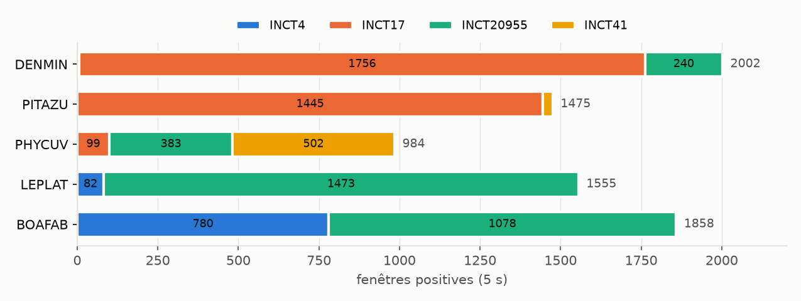
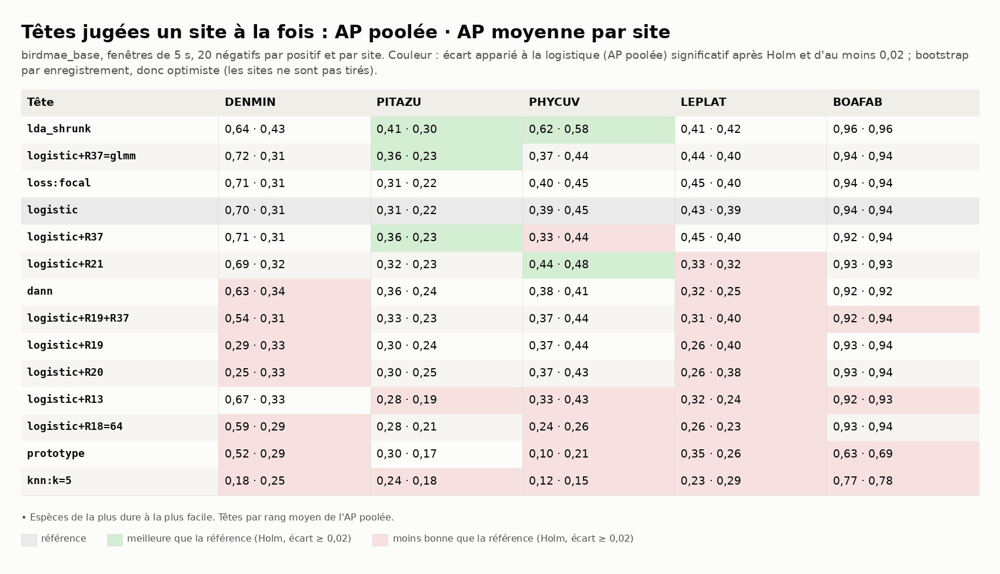
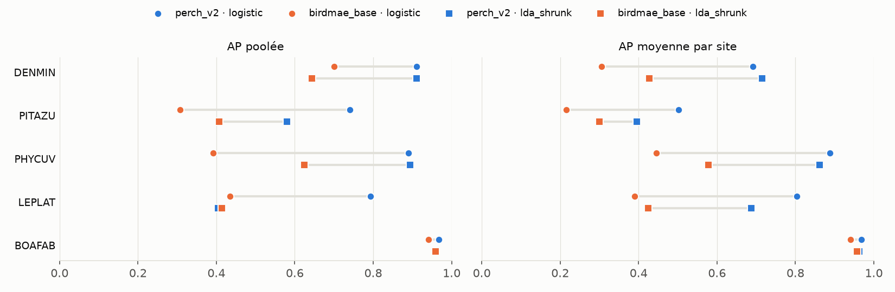
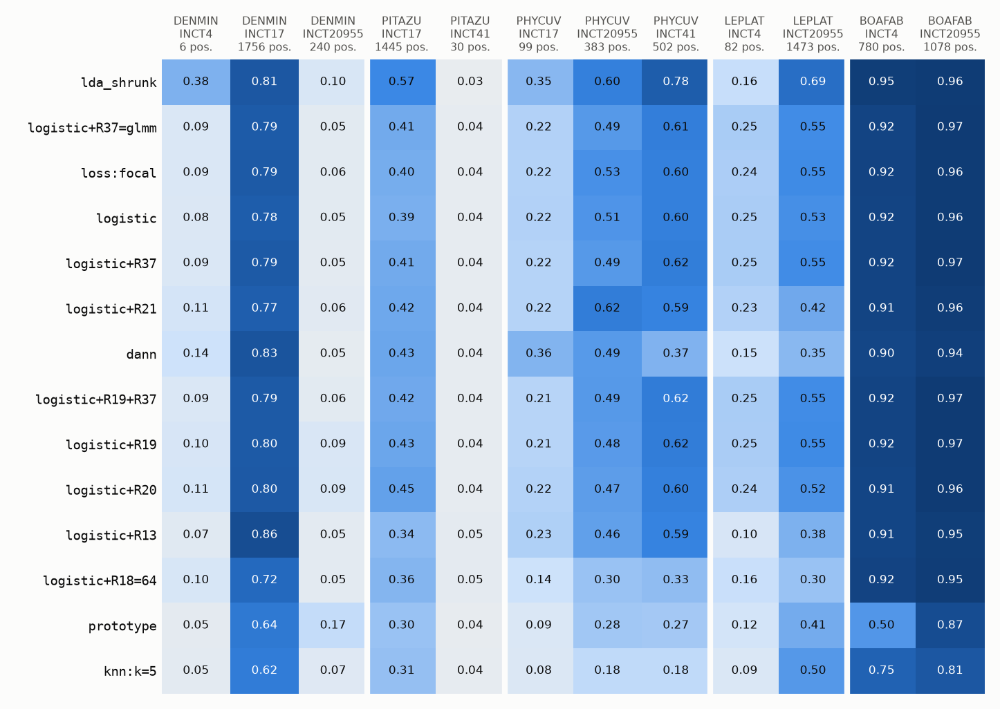
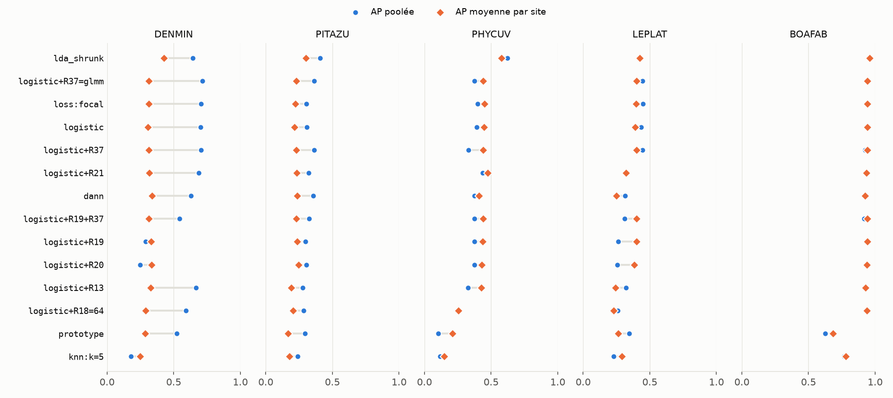

# Benchmark 04 — Têtes et régularisations sur AnuraSet, un site à la fois (birdmae_base)

29/09/2026 · commit `9d18e78` · statut : **indicateur** (d'autres anoures qu'A. blanci ; 2 à 3
sites par espèce ; un seul tirage).

## En bref

- **Avec Bird-MAE-Base gelé, la logistique sépare bien moins ces anoures que perch_v2** :
  AP poolée de 0,31 à 0,70 sur 4 espèces sur 5 (perch_v2 : 0,74 à 0,91, benchmark 01) ;
  BOAFAB reste haute (0,94 contre 0,97). Les poids sont bien chargés (annexe A).
- **La LDA régularisée (`lda_shrunk`) mène le rang moyen**, comme avec protoclr (benchmark
  02) : +0,23 sur PHYCUV, +0,10 sur PITAZU (Holm), sans perte significative ailleurs. Avec
  perch_v2, elle perdait 0,39 sur LEPLAT.
- **R19 et R20 cassent encore la comparaison entre sites** (DENMIN : AP poolée 0,29 et 0,25
  contre 0,70 ; AP par site inchangée) ; **R37 aide un peu sur PITAZU** (+0,06, Holm), comme
  avec perch_v2.
- **Le seuil ne voyage pas** : au seuil de précision 0,5 choisi sur les autres sites, le rappel
  poolé de la logistique va de 0,00 à 0,07 sur 4 espèces sur 5.
- **Amorçage d'un site peu annoté** : PITAZU à INCT41 (30 positives), AP 0,04 ; LEPLAT à INCT4
  (82), AP 0,25 contre 0,78 avec perch_v2.

## 1. Question

Sur le protocole du benchmark 01, que vaut Bird-MAE-Base (768 dimensions, préentraîné par
autoencodage masqué sur des chants d'oiseaux) comme représentation gelée ? Le classement des
têtes tient-il d'un encodeur à l'autre ?

## 2. Données

Mêmes enregistrements, mêmes fenêtres et mêmes positives que le benchmark 01 : 1 599
enregistrements (chants datés + fichiers sans espèce, aucun drapeau QC écarté, n° 141),
19 166 fenêtres de 5 s jointives, 5 espèces.



*Figure 1 — Fenêtres positives de chaque espèce, par site (identique au benchmark 01).*

## 3. Pipeline et choix

Identiques au benchmark 01 (tableau §3 de `2026-09-28_anuraset_perch_v2/RAPPORT.md`), sauf :

| Étape | Choix | Pourquoi |
|---|---|---|
| Encodeur | birdmae_base : `DBD-research-group/Bird-MAE-Base` via bacpipe 1.3.5, torch CPU, transformers 4.57 | variante Base retenue au n° 72 (Huge : 0,5 fenêtre/s) ; transformers 5 ne charge pas le code du modèle |
| Amorçage | par site : AP, rappel **et précision obtenue** au seuil de précision 0,5 choisi sur les scores hors-pli des autres sites ; rappel au seuil choisi sur place (oracle) ; 5 têtes, perch_v2 refait à l'identique pour comparer | ce que verrait un site neuf sans annotation (`amorcage.py`, `donnees/amorcage.csv`) |

## 4. Résultats

### Régime normal : sites annotés, AP poolée et par site



*Figure 2 — AP poolée · AP moyenne par site. En couleur : écart à la logistique significatif
(Holm, 65 comparaisons) et d'au moins 0,02.*



*Figure 3 — Même protocole, deux encodeurs : logistique (ronds) et LDA (carrés). L'écart est
le plus grand sur PHYCUV (0,39 contre 0,89) et LEPLAT (0,43 contre 0,79).*



*Figure 4 — AP de chaque tête sur chaque site tenu à l'écart. DENMIN à INCT20955 (240
positives) : ≤ 0,17 pour toutes les têtes.*



*Figure 5 — Grand écart entre les deux marqueurs : sites sur des échelles différentes (R19,
R20 sur DENMIN et LEPLAT ; la logistique elle-même sur DENMIN, 0,70 contre 0,31).*

Rappel poolé à précision 0,5, seuil de chaque site choisi sur les autres (entre parenthèses :
seuil choisi sur l'ensemble, oracle) :

| Tête | DENMIN | PITAZU | PHYCUV | LEPLAT | BOAFAB |
|---|---|---|---|---|---|
| logistic | 0,04 (0,77) | 0,00 (0,00) | 0,07 (0,00) | 0,04 (0,32) | 0,95 (0,95) |
| logistic+R37 | 0,06 (0,76) | 0,00 (0,00) | 0,08 (0,00) | 0,04 (0,46) | 0,95 (0,95) |
| lda_shrunk | 0,12 (0,66) | 0,02 (0,11) | 0,69 (0,72) | 0,13 (0,23) | 0,97 (0,98) |

Un oracle à 0 : aucun seuil n'atteint la précision 0,5 sur l'ensemble des sites.

### Amorçage d'un site peu annoté

Seuil de précision 0,5 choisi sur les autres sites, appliqué au site peu annoté :

| Cas | Encodeur | Tête | AP du site | Rappel | Précision obtenue |
|---|---|---|---|---|---|
| PITAZU · INCT41 (30 pos.) | birdmae_base | logistic | 0,04 | 0,00 | — |
| | perch_v2 | logistic | 0,19 | 0,67 | 0,11 |
| | perch_v2 | logistic+R18=64 | 0,42 | 0,90 | 0,20 |
| LEPLAT · INCT4 (82 pos.) | birdmae_base | logistic | 0,25 | 0,71 | 0,13 |
| | perch_v2 | logistic | 0,78 | 0,84 | 0,40 |
| | perch_v2 | logistic+R37 | 0,79 | 0,83 | 0,52 |

La précision promise (0,5) n'est tenue qu'une fois sur ces six lignes. Toutes les têtes :
`donnees/amorcage.csv`.

## 5. Hypothèses

1. **Représentation MAE gelée.** Un autoencodage masqué apprend à reconstruire le spectrogramme,
   pas à séparer des espèces : ses auteurs signalent un sondage linéaire faible et proposent un
   sondage par prototypes sur les jetons. Ici, logistique à 0,31–0,70 là où perch_v2
   (supervisé sur des espèces) tient 0,74–0,91. Test : tête attentive ou par prototypes sur les
   jetons de Bird-MAE (non calculés sur AnuraSet).
2. **Pourquoi la LDA gagne.** La LDA blanchit la covariance intra-classe ; si les embeddings MAE
   sont dominés par quelques directions de forte variance sans rapport avec le chant, les
   retirer aide. Même effet avec protoclr (benchmark 02), pas avec perch_v2. Test : AP de la
   logistique après blanchiment (ACP blanchie ou R17) sur ce stock.
3. **Échelle entre sites.** DENMIN : AP poolée 0,70 mais par site 0,31 ; l'AP d'INCT17 tombe à
   0,78 (0,97 avec perch_v2) et INCT20955 à 0,05. Les scores séparent d'abord les sites ; le
   classement dans un site reste faible. Même mécanisme R19/R20 qu'au benchmark 01 (espèce
   présente dans 26 à 41 % des fenêtres de son site).
4. **Seuil.** Précision 0,5 hors d'atteinte sur l'ensemble pour PITAZU et PHYCUV (oracle 0) : le
   problème n'est pas seulement le transport du seuil, les scores eux-mêmes ne classent pas
   assez haut les positives.

## 6. Ce qu'on en retient pour A. blanci

- birdmae_base gelé + tête linéaire n'est pas un candidat face à perch_v2 sur ces anoures ;
  à ne rejuger que si une tête sur jetons (hypothèse 1) le relève.
- `lda_shrunk` : bonne tête sur des embeddings non supervisés (protoclr, birdmae_base), mauvaise
  sur perch_v2 (LEPLAT). Le choix de la tête dépend de l'encodeur ; ne pas le figer avant
  l'encodeur.
- Le site neuf demande son propre seuil, quel que soit l'encodeur (confirmé : la précision
  obtenue au seuil venu d'ailleurs est de 0,11 à 0,52 contre 0,5 promis).

## 7. Limites

- Autres espèces, autres enregistreurs ; un seul tirage de négatifs ; BOAFAB saturée.
- 2 à 3 sites par espèce : bootstrap par enregistrement, intervalles optimistes ; l'amorçage
  repose sur 30 et 82 positives.
- Fenêtres jointives de 5 s ; Bird-MAE est préentraîné sur des chants d'oiseaux à 32 kHz, sans
  anoures : c'est aussi ce qu'on mesure.
- Un seul checkpoint (Base) ; Huge (n° 72) n'a pas été essayé.

## 8. Suites

1. Tête attentive / par prototypes sur les jetons de Bird-MAE-Base (hypothèse 1).
2. Logistique sur embeddings blanchis, pour les trois encodeurs non supervisés (hypothèse 2).
3. Seuil par site : combien d'annotations sur place pour atteindre la précision promise ?

---

## Annexe A — Contrôles

- **Poids** : `AutoModel.from_pretrained("DBD-research-group/Bird-MAE-Base")` : 0 clé
  manquante, 0 inattendue ; 152 tenseurs, identiques au `model.safetensors` du cache.
- **Tirage** : `amorcage.py` refait les fenêtres et les têtes ; l'AP par site retombe sur
  `donnees/sites.csv` (birdmae_base) et sur les chiffres du benchmark 01 (perch_v2 : 0,81 ;
  0,19 ; 0,83 ; 0,78).
- transformers 5.17 refuse le code distant du modèle (`all_tied_weights_keys`) ; 4.57 le charge.

## Annexe B — Reproduire

Stock et base : branche `donnees-anuraset-birdmae_base` (`data/LISEZMOI_donnees_anuraset.md`).

```
uv pip install --no-deps bacpipe==1.3.5   # + tqdm librosa huggingface_hub panel matplotlib
# seaborn plotly torchaudio, torch CPU, "transformers>=4.45,<5"
OMP_NUM_THREADS=1 uv run blanci --config <config par espèce> anuraset campaign \
    --encoders birdmae_base --species DENMIN      # puis PITAZU, PHYCUV, LEPLAT, BOAFAB
OMP_NUM_THREADS=1 uv run python documentation/benchmarks/2026-09-29_anuraset_birdmae_base/amorcage.py birdmae_base
OMP_NUM_THREADS=1 uv run python documentation/benchmarks/2026-09-29_anuraset_birdmae_base/amorcage.py perch_v2
uv run --group notebook python documentation/benchmarks/2026-09-29_anuraset_birdmae_base/generer.py
```

Config par espèce : `anuraset/anuraset.yaml` avec `paths.reports` propre à l'espèce et
`regularization.R37.glmm_grid: [0.3, 1.0, 3.0]` (comme le benchmark 01). Une espèce par
processus, 1 thread BLAS : à 5 processus sans cette limite, la charge montait à 32 sur 4 cœurs
et les têtes n'avançaient plus.

Durées (CPU, 4 cœurs) : téléchargement 7 min (7,2 Go, 12 plages), mesure préalable 6,9
fenêtres/s sur 64 fenêtres, encodage ≈ 45 min à 7,3–7,9 fenêtres/s (en trois reprises : le
conteneur a redémarré deux fois, l'encodage a repris où il en était), têtes 5 à 10 min par
espèce (`donnees/durees_s.csv`). `perch_v2_*.csv` : copies des données du benchmark 01.
