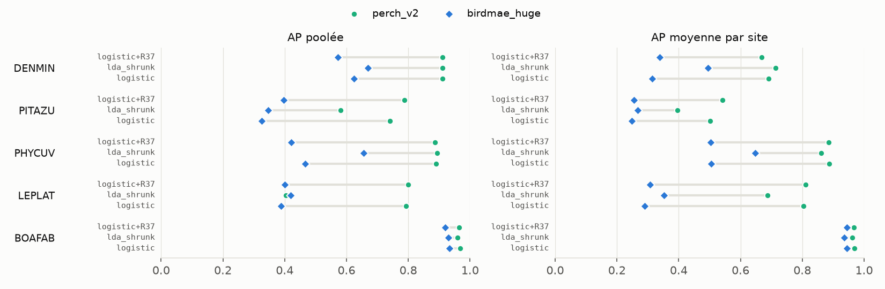
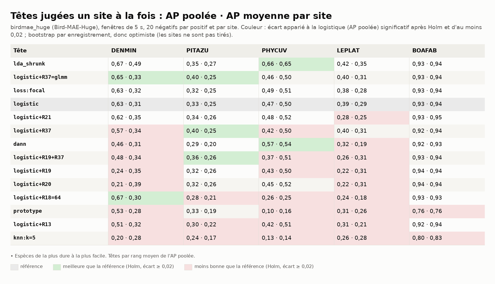
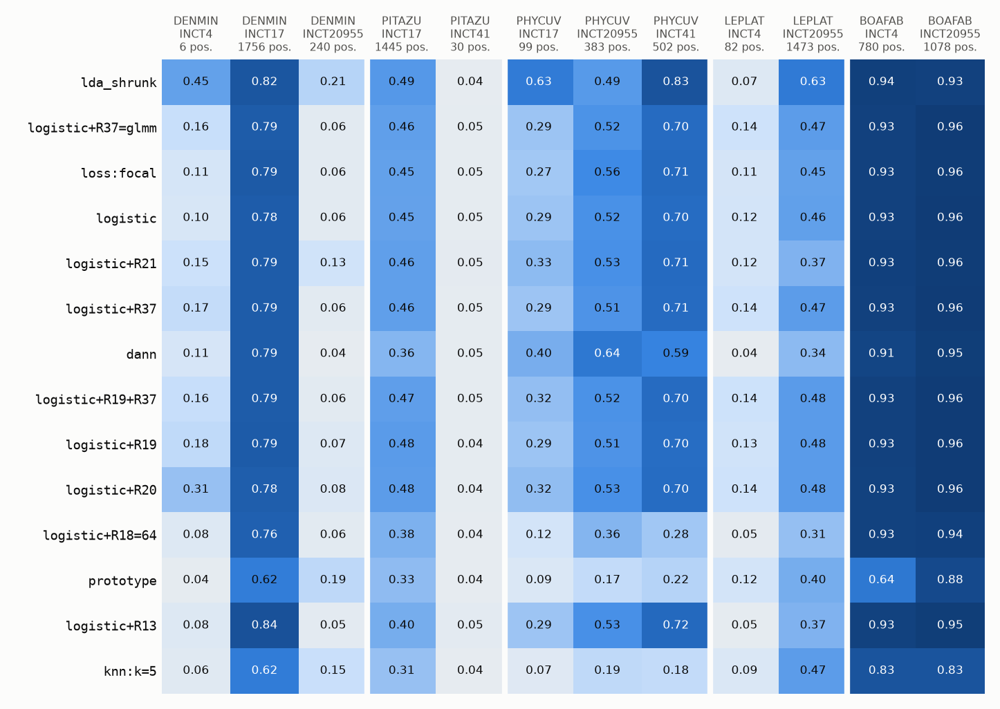
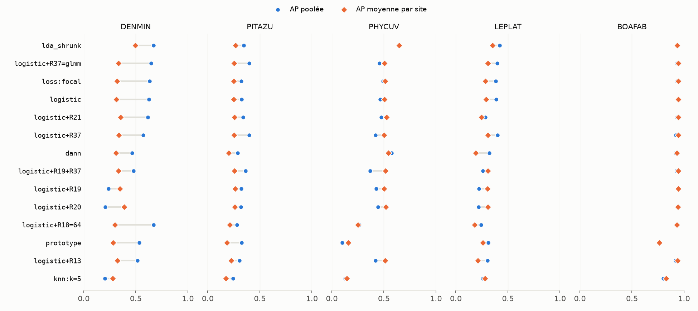
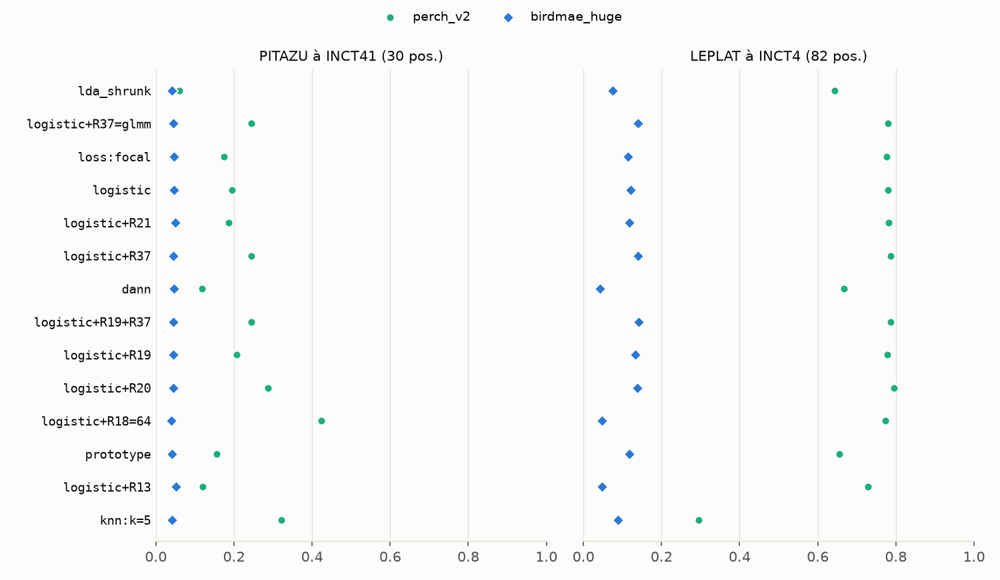

# Benchmark 06 — Têtes et régularisations sur AnuraSet, un site à la fois (birdmae_huge)

> **Note de l'audit du 10/10/2026 :** les p-valeurs de ce rapport sont calculées par amorçage
> avec 1 000 tirages, selon p = 2·k/n. Quand aucun tirage ne traverse 0, p vaut 0. Environ la
> moitié des comparaisons sont dans ce cas et sortent « significatives après Holm ». Avec le calcul
> corrigé, p = 2·(k+1)/(n+1) a un plancher, et plus aucune comparaison ne survivrait à Holm sur
> 115 à 245 comparaisons. Les intervalles de confiance restent valables. Lire « après Holm »
> comme « intervalle à 95 % qui exclut 0 », en attendant une relance avec plus de tirages.

29/09/2026 · commit `a09c792` · stock `birdmae_huge-bacpipe1.3.5@o0` (branche
`donnees-anuraset-birdmae_huge`) · statut : **indicateur** (d'autres anoures qu'A. blanci ;
2 à 3 sites par espèce ; un seul mode de lecture des embeddings, la moyenne des jetons).

## En bref

- **birdmae_huge, lu comme bacpipe le rend (moyenne des jetons), est loin de perch_v2** avec
  le même protocole. Avec la logistique, l'AP poolée perd 0,29 à 0,42 sur les 4 espèces non
  saturées : DENMIN 0,63 contre 0,91, PHYCUV 0,47 contre 0,89. L'AP par site perd autant.
  BOAFAB, saturée, ne perd que 0,03.
- **La meilleure tête change** : LDA à covariance rétrécie en tête du classement, alors que
  c'était la logistique avec perch_v2. PHYCUV : +0,19 sur la logistique, écart qui survit à
  Holm. DENMIN : 0,67 contre 0,63, écart non significatif.
- **L'amorçage d'un site peu annoté échoue.** PITAZU à INCT41 : AP ≈ 0,05 pour toutes les
  têtes, soit le niveau du hasard (perch_v2 : 0,19 à 0,42). LEPLAT à INCT4 : 0,12 (perch_v2 :
  0,78).
- **R37 sur PITAZU se retrouve avec un second encodeur** : +0,07 d'AP poolée, écart qui
  survit à Holm (+0,05 avec perch_v2).
- **Huge ne fait pas mieux que Base (benchmark 04)** : logistique, AP poolée DENMIN 0,63
  contre 0,70, PHYCUV 0,47 contre 0,39, LEPLAT 0,39 contre 0,43. Les écarts vont dans les
  deux sens, sans tendance ; LDA mène avec les deux. Base est 7 fois plus rapide.
- **Les embeddings sont presque tous alignés** : norme constante (35,78) et cosinus médian de
  0,997 avec leur moyenne. Le chant ne se lit que dans de petits écarts, ce qui oriente les
  hypothèses 1 et 2.

## 1. Question

Le plus gros encodeur de bacpipe (Bird-MAE-Huge, 632 M paramètres) généralise-t-il mieux que
perch_v2 à un site jamais vu, avec les mêmes têtes et le même protocole que le benchmark 01 ?

## 2. Données

Identiques au benchmark 01 : 1 599 enregistrements AnuraSet (1 206 aux chants datés, 393 sans
espèce), 19 166 fenêtres de 5 s jointives, sélection du n° 141. Mêmes 5 espèces (figure 0,
reprise du benchmark 01).


*Figure 0 — Fenêtres positives de chaque espèce, par site.*

## 3. Pipeline et choix

| Étape | Choix | Pourquoi |
|---|---|---|
| Encodeur | `birdmae_huge` : Bird-MAE-Huge via bacpipe 1.3.5, CPU, 1 280 dimensions, moyenne des jetons de la dernière couche | le calcul de `birdmae` (extracteur de Base, réseau Huge), sous un nom qui le distingue de `birdmae_base` ; embeddings vérifiés identiques à ceux de `birdmae` (écart max 0) |
| Tout le reste | comme le benchmark 01 : labels (n° 138), 20 négatifs par positif et par site, un pli par site, C et σ par plis internes, `glmm_grid: [0.3, 1, 3]` | seul l'encodeur change |
| Têtes | les 14 de `anuraset.CAMPAIGN_HEADS` | même liste que le benchmark 01 |
| Comparaisons | écart apparié à la logistique, bootstrap par enregistrement, Holm sur 65 comparaisons (13 têtes × 5 espèces) | idem (n° 139) ; optimiste |
| Exécution | une espèce par processus | chaque espèce part de la graine |

## 4. Résultats



*Figure 1 — Trois têtes, les deux encodeurs. L'écart est du même ordre en AP poolée et par
site : c'est le classement lui-même qui se dégrade, pas seulement l'échelle entre sites.*



*Figure 2 — AP poolée · AP moyenne par site. Couleur : écart à la logistique significatif
(Holm) et d'au moins 0,02.*



*Figure 3 — AP de chaque tête sur chaque site tenu à l'écart.*



*Figure 4 — R19 et R20 cassent encore l'échelle commune sur DENMIN (0,24 et 0,21 d'AP poolée
contre 0,35 et 0,39 par site), comme avec perch_v2.*

**Régime normal** (site bien annoté tenu à l'écart). Rappel à précision 0,5 de la logistique,
seuil choisi sur les autres sites (entre parenthèses : seuil choisi sur place) :

| | DENMIN | PITAZU | PHYCUV | LEPLAT | BOAFAB |
|---|---|---|---|---|---|
| birdmae_huge | 0,12 (0,63) | 0,01 (0,00) | 0,53 (0,61) | 0,01 (0,10) | 0,94 (0,94) |
| perch_v2 | 0,89 (0,92) | 0,01 (0,92) | 0,91 (0,92) | 0,59 (0,87) | 0,99 (0,99) |

**Amorçage d'un site peu annoté** (seuil choisi ailleurs) :



*Figure 5 — AP sur les deux sites presque vides, tenus à l'écart. Avec 20 négatifs par
positif, le hasard donne ≈ 0,05 : birdmae_huge y est sur PITAZU à INCT41, et à 0,12 au mieux
sur LEPLAT à INCT4.*

## 5. Hypothèses

1. **Des embeddings presque alignés.** Toutes les fenêtres ont la même norme (35,78, trace
   probable d'une normalisation de couche en sortie) et un cosinus de 0,997 avec leur moyenne.
   La logistique standardise chaque dimension, mais ne décorrèle pas les dimensions entre
   elles. La LDA à covariance rétrécie le fait, et c'est elle qui gagne (PHYCUV +0,19 ;
   DENMIN +0,04, non significatif). Le chant serait porté par des directions de faible variance. Même lecture
   pour l'ACP à 64 composantes (R18=64), qui s'effondre sur PHYCUV (0,26 contre 0,47) : elle
   ne garde que les directions de forte variance. Test : logistique sur embeddings blanchis
   (ACP blanchie, toutes composantes).
2. **La moyenne des jetons n'est pas la bonne lecture d'un MAE.** Un autoencodeur masqué
   apprend à reconstruire des patchs, pas à séparer des classes. Une fois moyennés sur toute
   la fenêtre, ses jetons séparent mal une note brève. Les auteurs de Bird-MAE proposent de
   le lire par une sonde sur les jetons (prototypes) plutôt que par la moyenne. Test : sonde
   attentive sur les jetons (`blanci.heads.attentive`, déjà prête pour perch_v2).
3. **Le seuil voyage encore moins.** Sur DENMIN, le rappel à précision 0,5 tombe à 0,12 avec
   un seuil choisi ailleurs (0,63 sur place). Des scores moins séparés rendent le seuil plus
   sensible au décalage entre sites (hypothèse 5 du benchmark 01).
4. **R37 sur PITAZU tient à la structure des données, pas à l'encodeur.** Le biais par site
   absorbe l'écart de proportion de positifs entre INCT17 (34 %) et INCT41 (0,7 %) quel que
   soit l'espace d'embeddings : le gain se répète (+0,05, puis +0,07).

## 6. Ce qu'on en retient pour A. blanci

- **perch_v2 reste l'encodeur de référence.** birdmae_huge, lu par la moyenne, est plus
  faible partout sauf sur BOAFAB (saturée). Il est aussi 14 fois plus lent : 1,1 fenêtre/s ici contre 15,5 (n° 137), 0,5
  contre 7,0 sur l'i5 (n° 72).
- **Entre les deux Bird-MAE, garder Base** s'il faut en garder un : même AP (benchmark 04),
  7 fois plus rapide (7,5 contre 1,1 fenêtre/s ici).
- **Ne pas écarter Bird-MAE sur ce seul chiffre** : les hypothèses 1 et 2 visent la manière
  de lire les embeddings, pas le modèle. Le stock est poussé pour les tester sans réencoder.
  La question vaut aussi pour `birdmae_base` (n° 147), lu de la même manière.
- **R37 reste à tester sur les données ONF**, avec un indice de plus : son gain sur PITAZU
  se répète avec un second encodeur.

## 7. Limites

- Comme le benchmark 01 : autres espèces, 2 à 3 sites par espèce, bootstrap optimiste, un
  seul tirage de négatifs.
- Une seule lecture des embeddings (moyenne des jetons de la dernière couche, celle de
  bacpipe) ; ni couches intermédiaires, ni jetons.
- Bird-MAE-Huge a été pré-entraîné sur des oiseaux (XCL de BirdSet) ; perch_v2 couvre aussi
  des anoures. L'écart mesure autant la couverture taxonomique que l'architecture.

## 8. Suites

1. Logistique sur embeddings blanchis (hypothèse 1) : minutes, sans réencoder.
2. Sonde attentive sur les jetons de Bird-MAE (hypothèse 2) : demande de réencoder en gardant
   les jetons, donc environ 5 h ici.
3. Si l'une des deux rattrape perch_v2 : refaire l'amorçage (PITAZU/INCT41, LEPLAT/INCT4).

---

## Annexe — Reproduire

```
# encodage (1 599 enregistrements, sélection du n° 141) : data/runs/encode_birdmae.py,
# équivalent à l'étape 3 de anuraset campaign avec --encoders birdmae_huge
uv run blanci --config anuraset/anuraset.yaml anuraset heads \
    --encoder birdmae_huge-bacpipe1.3.5@o0 --species DENMIN \
    --methods "$(python -c 'from blanci.evaluation.anuraset import CAMPAIGN_HEADS as H; print(",".join(H))')"
uv run --group notebook python documentation/benchmarks/2026-09-29_anuraset_birdmae_huge/generer.py
```

Une espèce par processus, `reports` séparé par espèce, `regularization.R37.glmm_grid:
[0.3, 1.0, 3.0]`. Holm est recalculé sur les 5 espèces ensemble (`comparaisons.csv`), comme au
benchmark 01. bacpipe installé sans dépendances : torch et torchaudio (CPU), librosa, panel,
matplotlib, seaborn et plotly, que bacpipe demande à l'import, et **transformers < 5** (avec
la 5.x, le code distant de Bird-MAE échoue : `all_tied_weights_keys`).

Durées (CPU, 4 cœurs) : téléchargement 6 min, encodage 4 h 50 (1,1 fenêtre/s ; interrompu une
fois par un redémarrage de la machine, repris sans perte), têtes 6 à 14 min par espèce.
`donnees/` : les CSV de ce benchmark ; `*_perch_v2.csv` : ceux du benchmark 01, pour la
figure 1 et la figure 5.
