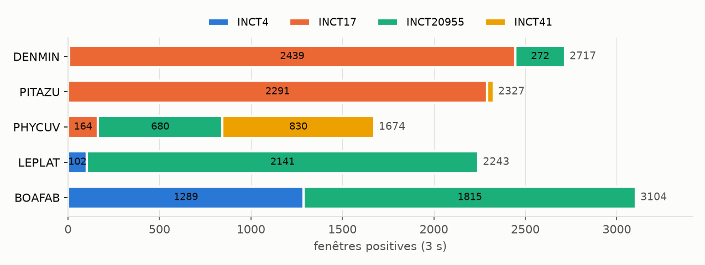
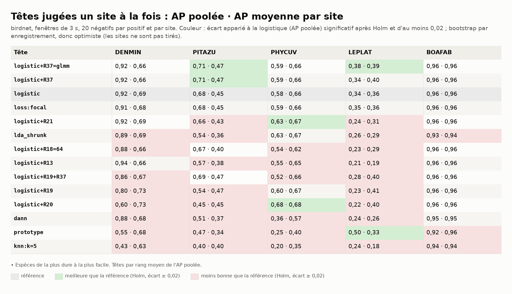
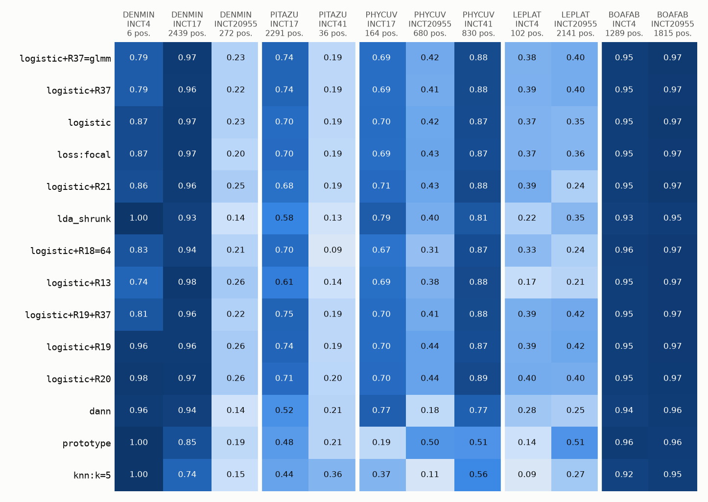
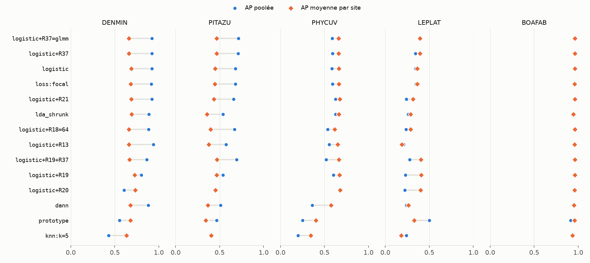
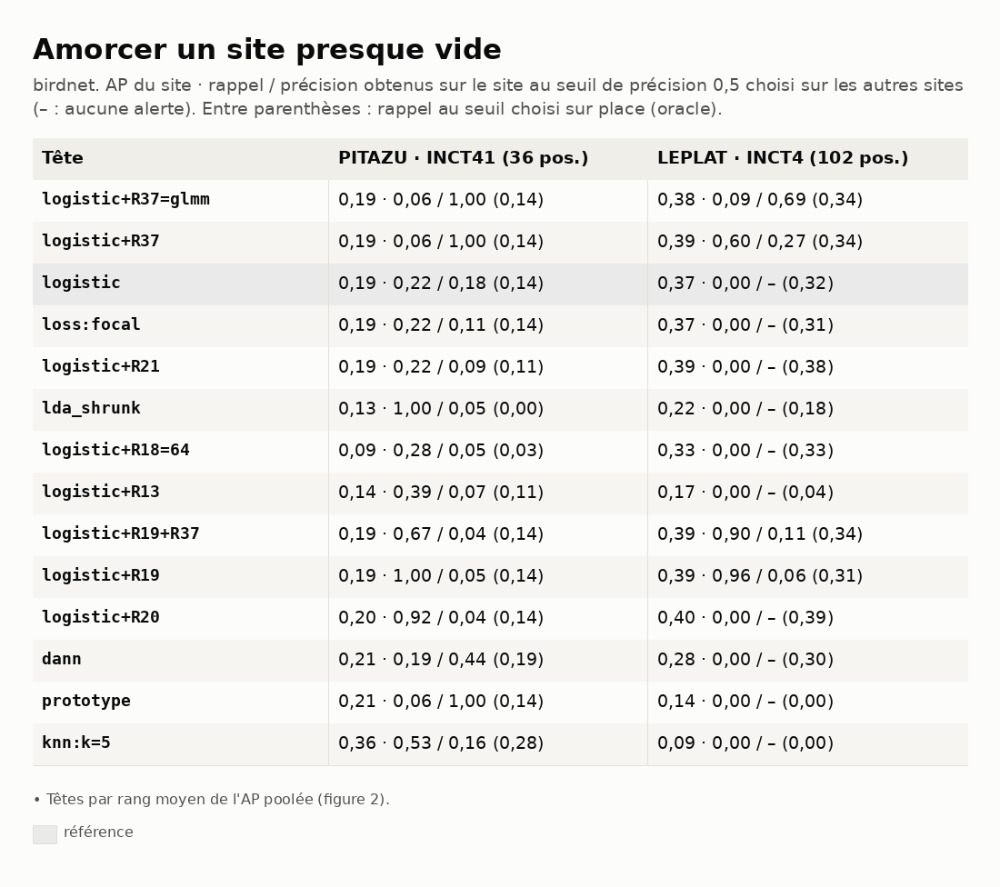

# Benchmark 05 — Têtes et régularisations sur AnuraSet, un site à la fois (birdnet)

> **Note de l'audit du 10/10/2026 :** les p-valeurs de ce rapport sont calculées par amorçage
> avec 1 000 tirages, selon p = 2·k/n. Quand aucun tirage ne traverse 0, p vaut 0. Environ la
> moitié des comparaisons sont dans ce cas et sortent « significatives après Holm ». Avec le calcul
> corrigé, p = 2·(k+1)/(n+1) a un plancher, et plus aucune comparaison ne survivrait à Holm sur
> 115 à 245 comparaisons. Les intervalles de confiance restent valables. Lire « après Holm »
> comme « intervalle à 95 % qui exclut 0 », en attendant une relance avec plus de tirages.

29/09/2026 · commit `9d18e78` · statut : **indicateur** (d'autres anoures qu'A. blanci ; 2 à 3
sites par espèce ; un seul tirage).

## En bref

- **birdnet égale perch_v2 sur DENMIN et PITAZU, décroche sur PHYCUV et LEPLAT** :
  logistique, AP poolée 0,92 / 0,68 / 0,58 / 0,34 / 0,96 (perch_v2 : 0,91 / 0,74 / 0,89 /
  0,79 / 0,97). Les deux espèces qui décrochent ont les chants les plus longs (p90 3,6 et
  2,7 s) pour une fenêtre de 3 s.
- **Même haut de classement qu'avec les deux Perch** : R37=glmm et R37 en tête du rang moyen ;
  R37 +0,03 sur PITAZU (Holm), comme avec perch_v2 et perch_bird. kNN, prototype en bas.
- **R19, R20** : même motif (AP poolée en baisse sur DENMIN, PITAZU, LEPLAT, AP par site
  stable ou meilleure) ; R20 +0,09 sur PHYCUV.
- **Amorçage des sites presque vides : non** (PITAZU/INCT41, AP ≤ 0,36 ; LEPLAT/INCT4,
  ≤ 0,40) ; le seuil choisi ailleurs donne soit aucune alerte, soit une précision ≤ 0,27, à
  quelques exceptions sur une poignée d'alertes.
- Encodage 23 min (31 938 fenêtres de 3 s), têtes 6 à 18 min par espèce.

## 1. Question

Sur le protocole du benchmark 01, que vaut BirdNET (référence du tuteur, 1 024 dimensions,
fenêtres de 3 s) sur ces anoures, et le classement des têtes tient-il ?

## 2. Données

Mêmes enregistrements et espèces que le benchmark 01 (n° 141). **Fenêtres de 3 s** (fenêtre
native de BirdNET), jointives : 31 938 fenêtres ; plus de fenêtres positives, et un chant
long est plus souvent coupé (la fenêtre qui en porte la plus grande part est positive, les
autres écartées, n° 138).

*Figure 1 — Fenêtres positives de chaque espèce, par site.*

## 3. Pipeline et choix

Identiques au benchmark 01, sauf l'encodeur : birdnet (bacpipe 1.3.5, TensorFlow CPU),
1 024 dimensions, 48 kHz, 3 s. Amorçage : comme au benchmark 02 (`donnees/amorcage.csv`).

## 4. Résultats

*Figure 2 — AP poolée · AP moyenne par site. En couleur : écart à la logistique significatif
(Holm) et d'au moins 0,02.*

*Figure 3 — AP de chaque tête sur chaque site tenu à l'écart.*

*Figure 4 — AP poolée contre AP moyenne par site.*

*Figure 5 — Sites presque vides : AP du site · rappel / précision au seuil choisi ailleurs
(rappel au seuil choisi sur place).*

Rappel à précision 0,5, seuil choisi sur les autres sites (seuil sur place) :

| Tête | DENMIN | PITAZU | PHYCUV | LEPLAT | BOAFAB |
|---|---|---|---|---|---|
| logistic | 0,86 (0,94) | **0,00** (0,85) | 0,48 (0,62) | 0,00 (0,00) | 0,97 (0,98) |
| logistic+R37 | 0,94 (0,95) | **0,00** (0,90) | 0,51 (0,62) | 0,03 (0,00) | 0,98 (0,98) |
| logistic+R19 | 0,58 (0,80) | 0,02 (0,76) | 0,50 (0,64) | 0,04 (0,01) | 0,96 (0,97) |

## 5. Hypothèses

1. **Fenêtre de 3 s et chants longs.** PHYCUV (médiane 1,0 s, p90 3,6 s) et LEPLAT (0,8 s,
   p90 2,7 s) sont les deux espèces aux chants les plus longs ; une fenêtre de 3 s n'en voit
   souvent qu'une partie, et les fenêtres voisines, qui en portent le reste, sont écartées.
   DENMIN et PITAZU, brèves, ne perdent rien. Test : AP au niveau enregistrement, ou fenêtres
   chevauchantes (overlap 0,5), sur ces deux espèces.
2. **R37** gagne sur PITAZU avec les trois encodeurs forts (perch_v2, perch_bird, birdnet) :
   l'effet suit l'espèce (proportions de positifs 34 % contre 0,7 % entre ses deux sites),
   pas l'encodeur.
3. **R20 sur PHYCUV (+0,09)** : espèce rare dans chaque site (2 à 12 %), le centrage ne retire
   pas de chant ; il retire peut-être le fond propre à chaque site, qui pèse plus quand la
   représentation du chant est partielle (hypothèse 1).

## 6. Ce qu'on en retient pour A. blanci

- A. blanci émet des notes brèves (≤ 0,3 s) : le cas de DENMIN et PITAZU, où birdnet égale
  perch_v2. La fenêtre de 3 s n'est pas un défaut pour elle a priori ; à vérifier sur les
  données ONF.
- R37 reste la régularisation à tester en premier sur les données ONF, quel que soit
  l'encodeur.

## 7. Limites

- Mêmes limites que le benchmark 01 ; grille de 3 s différente de celle de perch_v2 (5 s) :
  la comparaison entre encodeurs mêle représentation et découpage ; tirages de négatifs
  indépendants par run.

## 8. Suites

1. Hypothèse 1 : niveau enregistrement ou overlap 0,5 sur PHYCUV et LEPLAT.
2. Écart apparié entre encodeurs sur un tirage commun, au niveau enregistrement (seul niveau
   commun à des grilles de 3, 5 et 6 s).

---

## Annexe — Reproduire

Comme le benchmark 02 (`anuraset/`), avec `birdnet` et
`birdnet-bacpipe1.3.5@o0` (TensorFlow CPU requis). Stock sur la branche
`donnees-anuraset-birdnet`. Durées (CPU, 4 cœurs) : encodage 23 min (24 fenêtres/s), têtes 6
à 18 min par espèce (`donnees/durees_s.csv`).
