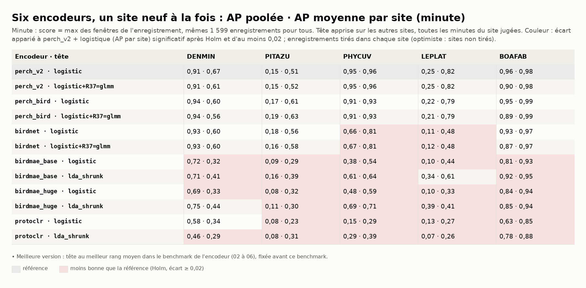
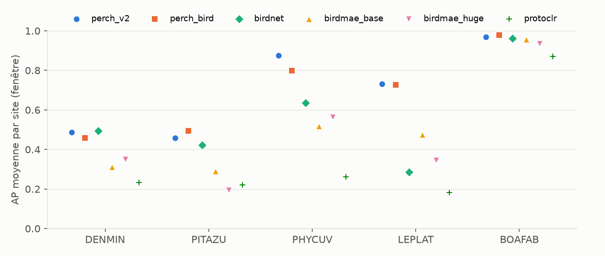
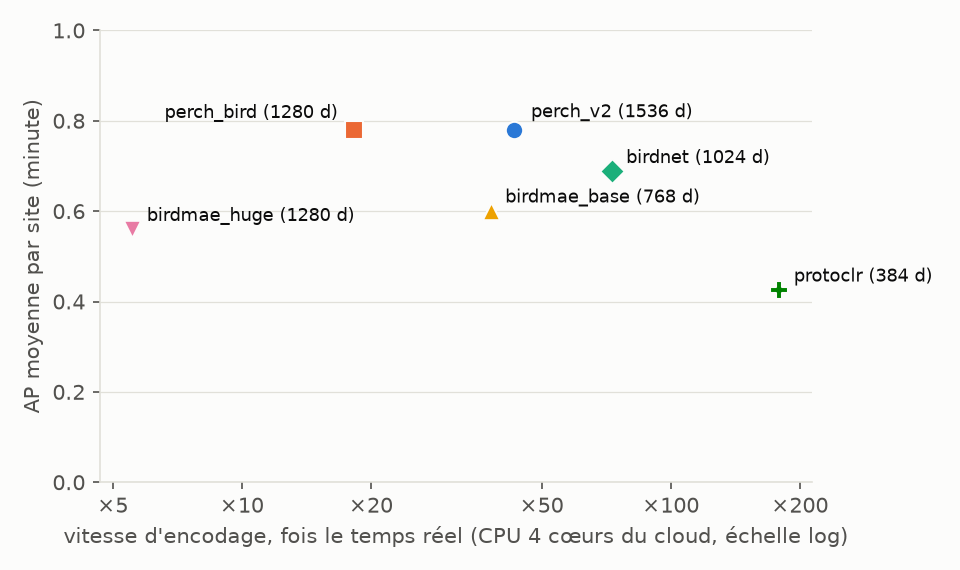
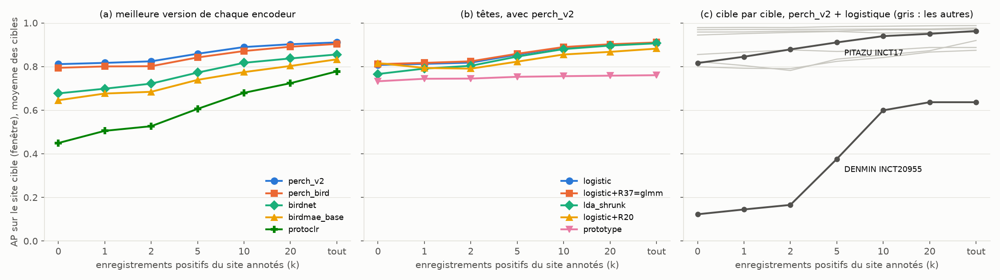

# Benchmark 07 — Six encodeurs côte à côte, et l'amorçage d'un site (AnuraSet)

29/09/2026 · commit `1176c87` · statut : **indicateur** (d'autres anoures qu'A. blanci ; 2 à 4
sites par espèce ; un seul tirage des négatifs d'apprentissage).

## En bref

- **perch_v2 et perch_bird à égalité, devant tous les autres.** AP moyenne par site, niveau
  minute : 0,79 et 0,78 ; aucun écart significatif après Holm. Viennent ensuite birdnet (0,68),
  birdmae_base (0,60), birdmae_huge (0,56) et protoclr (0,43).
- **birdnet égale Perch sur les chants brefs** (DENMIN, PITAZU, BOAFAB, écarts non
  significatifs). Il décroche sur les chants longs : PHYCUV −0,15, LEPLAT −0,35 (Holm). A.
  blanci émet des notes brèves : birdnet reste un candidat.
- **Un site neuf peu annoté : c'est la même tête qui gagne.** La logistique sur perch_v2 passe
  de 0,81 (aucune annotation du site) à 0,85 avec 5 enregistrements positifs annotés, puis 0,89
  avec 10 et 0,91 avec la moitié du site. Le gain vient des sites où le transfert échoue
  (DENMIN à INCT20955 : 0,12 → 0,60 à 10 annotés). R20 ne gagne que sans annotation (+0,01), le
  prototype reste loin derrière à tout k, et R37=glmm fait jeu égal avec la logistique.
- **Le seuil ne voyage pas pour une espèce présente sur deux sites seulement.** PITAZU et
  LEPLAT : aucune alerte au seuil appris sur l'autre site (rappel 0). Chaque site neuf
  demandera son propre seuil.
- **R37 n'est pas gratuite.** Elle ne change pas l'AP par site, mais fait baisser l'AP poolée
  quand des sites sans l'espèce entrent dans le lot (BOAFAB 0,96 → 0,90 avec perch_v2).

## 1. Question

Quel encodeur retenir pour A. blanci, et comment un site neuf se comporte-t-il selon le nombre
d'enregistrements qu'on y annote (0, quelques-uns, la moitié) ?

## 2. Données

Mêmes enregistrements, espèces et positifs que les benchmarks 01 à 06 (n° 141). Composition :
figure 1 du benchmark 01 (`../2026-09-28_anuraset_perch_v2/figures/1_positifs_par_site.png`).
Stocks des six encodeurs réunis dans une même base (fenêtres jointives de 3, 5 ou 6 s selon
l'encodeur). Nouveau : tout est jugé à la prévalence réelle, sur **toutes** les fenêtres du site
tenu à l'écart (16 000 à 32 000 selon la grille), plus sur 20 négatifs tirés par positif.

## 3. Pipeline et choix

| Étape | Choix | Pourquoi |
|---|---|---|
| Plis | un site tenu à l'écart à la fois (4 plis) | un site neuf est le cas réel (n° 125, 141) |
| Apprentissage | tous les positifs + 20 négatifs par positif et par site, C par plis internes par site | protocole des benchmarks 01 à 06 |
| Évaluation | toutes les fenêtres du site tenu à l'écart | prévalence réelle ; l'échantillon de négatifs rendait l'AP poolée optimiste |
| Unité commune | minute : score = max des fenêtres de l'enregistrement | grilles différentes (3, 5, 6 s) : seule unité identique pour tous ; apparié |
| Fenêtre | grille propre à chaque encodeur ; appariée seulement entre encodeurs à 5 s | mêmes fenêtres, mêmes labels |
| Têtes | logistique (commune) et la « meilleure version » fixée d'avance : logistic+R37=glmm (perch_v2, perch_bird, birdnet), lda_shrunk (Bird-MAE, protoclr) | meilleur rang moyen dans le benchmark de l'encodeur (02 à 06) ; choisie avant, donc sans biais du gagnant |
| Comparaisons | AP moyenne par site contre perch_v2 + logistique (fixée d'avance), bootstrap apparié qui tire les enregistrements dans chaque site, Holm par niveau | n° 139 ; les sites ne se tirent pas (2 à 4), l'intervalle reste optimiste |
| Seuil | précision 0,5 choisie sur les autres sites, appliquée au site (fenêtre) | n° 140 ; ce que donnerait un site sans annotation |
| Amorçage | 9 sites cibles (espèce × site à ≥ 30 enregistrements positifs) ; moitié en test, k enregistrements positifs de l'autre moitié (et des négatifs en proportion) ajoutés à l'entraînement ; k = 0, 1, 2, 5, 10, 20, tout ; 2 tirages ; 5 têtes ; 5 encodeurs (Huge exclu : vaut Base, n° 149) | mesure directe des deux pipelines : amorçage (k petit) et régime courant (tout) |

## 4. Résultats



*Figure 1 — AP poolée · AP moyenne par site, minute. Rouge : moins bonne que perch_v2 +
logistique (Holm, écart ≥ 0,02).*



*Figure 2 — Même lecture au niveau fenêtre (grille de chaque encodeur ; appariée entre
encodeurs à 5 s). perch_bird y perd PHYCUV (−0,08, Holm).*



*Figure 3 — Qualité contre vitesse d'encodage : perch_v2 est 2,4 fois plus rapide que
perch_bird pour la même AP.*



*Figure 4 — AP sur le site cible selon k. (a) le classement des encodeurs tient à tout k, l'écart
se resserre ; (b) les têtes, avec perch_v2 ; (c) les deux cibles où les annotations changent
tout.*

Seuil choisi sur les autres sites (perch_v2, logistique, fenêtre, précision visée 0,5) :

| Cas | Couples espèce × site | Ce qui se passe |
|---|---|---|
| le seuil tient | 5 sur 12 (BOAFAB ×2, DENMIN/INCT17, PHYCUV/INCT20955 et /INCT41) | rappel 0,73 à 0,98, précision 0,70 à 0,97 |
| aucune alerte | 4 (PITAZU ×2, LEPLAT ×2) | espèce sur deux sites : le seuil de l'un est hors d'échelle pour l'autre |
| trop d'alertes | 3 (DENMIN/INCT20955, DENMIN/INCT4, PHYCUV/INCT17) | précision 0,02 à 0,16 |

## 5. Hypothèses

1. **Les deux Perch représentent aussi bien ces anoures.** Tous deux ont appris sur Xeno-Canto,
   et perch_v2 sur d'autres taxons en plus : sur des chants brefs et tonals, cet ajout ne se
   voit pas. Seul écart apparié net : PHYCUV au niveau fenêtre (−0,08 pour perch_bird).
2. **birdnet et les chants longs** (n° 148, confirmé ici en apparié) : avec 3 s de fenêtre, un
   chant de PHYCUV (p90 3,6 s) est souvent coupé. Au niveau minute, où l'on prend le max des
   fenêtres, l'écart se réduit mais subsiste (−0,15 et −0,35, contre −0,24 et −0,45 en
   fenêtre, grilles différentes, non apparié) : ce n'est donc pas qu'une question de découpage des labels. Test : birdnet avec
   un chevauchement de 50 % (un chant coupé par une fenêtre tient entier dans la suivante).
3. **Pourquoi les annotations du site aident là où le transfert échoue.** DENMIN à INCT20955 :
   64 % de chants de faible qualité (n° 141) ; les autres sites n'apprennent pas cette version
   lointaine du chant, 10 enregistrements du site la montrent. Là où l'AP est déjà ≥ 0,9 sans
   annotation, il n'y a plus rien à gagner.
4. **R20 aide seulement sans annotation.** Elle centre chaque site sur sa propre moyenne, ce qui
   rapproche le site neuf des autres (+0,01 à k = 0). Dès qu'on ajoute des exemples du site,
   la logistique les exploite mieux sans ce recentrage (−0,02 à −0,03 à k ≥ 1). Le « R19/R20
   pour amorcer » tient donc, mais tout juste, et seulement tant qu'aucun exemple n'est annoté.
5. **R37 et l'AP poolée.** R37 range une part du score dans un biais par site. Un site neuf
   reçoit le biais par défaut, qui le place au niveau d'un site « moyen » : les sites sans
   l'espèce remontent dans le lot commun (BOAFAB : 0,96 → 0,90 ; avec birdmae_base,
   0,81 → 0,40). Test : même mesure avec le biais du site neuf fixé au minimum des biais
   appris.
6. **Pourquoi le seuil ne voyage pas pour une espèce sur deux sites.** Tenir un site à l'écart
   laisse un seul site à l'apprentissage, et le seuil s'y cale sur sa propre échelle de
   scores, que le site neuf ne partage pas. Chez A. blanci, avec un seul site annoté
   (Mataroni) au départ, c'est le cas attendu.

## 6. Ce qu'on en retient pour A. blanci

- **Encodeur : perch_v2.** Il fait jeu égal avec perch_bird, en 2,4 fois plus rapide, et rend
  ses jetons. perch_bird et birdnet restent les candidats à départager sur les données ONF (le
  §2 du projet). Bird-MAE et protoclr sont en retrait en sondage linéaire ; pas de verdict sur Bird-MAE
  avant une tête sur ses jetons (n° 151).
- **Tête : la logistique, dans les deux régimes.** R37=glmm n'apporte rien de mesurable ici, et
  dégrade l'AP poolée si la file d'annotation mélange des sites.
- **Pipeline d'amorçage d'un site : même encodeur, même tête, mais une stratégie
  d'annotation.** Il faut annoter au moins 5, idéalement 10 enregistrements positifs du site
  (1 ou 2 n'apportent presque rien : +0,01), et fixer le seuil sur place. R20 n'aide qu'en
  l'absence totale d'annotation.

## 7. Limites

- Anoures du Brésil, pas A. blanci ; 2 à 4 sites par espèce ; un seul tirage des négatifs
  d'apprentissage.
- Courbe d'amorçage : 9 cibles × 2 tirages, sans intervalle ; les écarts de moins de 0,01 entre
  têtes ne se lisent pas. À k = 20, DENMIN/INCT20955 plafonne à ses 18 enregistrements de
  réserve (k = 20 y vaut « tout »).
- Débits d'encodage mesurés sur des machines cloud différentes (4 cœurs chacune) : un ordre de
  grandeur, pas un classement fin.
- Sondage linéaire seulement : Bird-MAE et les transformers ne sont pas jugés sur leurs jetons
  (revue comparative 2025 : c'est là qu'ils se rattrapent, `documentation/encodeurs-bacpipe.md`).

## 8. Suites

1. Encoder AnuraSet avec naturebeats, birdnet_v3 et esp-aves2 (priorité 1 de
   `documentation/encodeurs-bacpipe.md`), puis les juger sur ce protocole.
2. Sur les données ONF, la même courbe d'amorçage, par micro puis par site, avec perch_v2 et
   la logistique. C'est elle qui dira combien d'enregistrements annoter sur un site neuf.
3. Tester le biais du site neuf pour R37 (hypothèse 5) avant tout usage dans une file commune.

---

## Annexe — Reproduire

Outils : `scripts/anuraset/` (`global_bench.py`, `rassembler_global.py`).
Stocks sur les branches `donnees-anuraset` (perch_v2) et `donnees-anuraset-<encodeur>`. Leurs
modèles (table `models`) et leurs fenêtres (table `windows`) sont réunis dans une même
`data/db/anuraset.sqlite`. Sorties brutes (scores hors-pli, courbes) : branche
`resultats-anuraset-07`, dossier `resultats/global/`.

```
uv run python scripts/anuraset/global_bench.py <encodeur> <ESPECE> <sorties> --curve
uv run python scripts/anuraset/rassembler_global.py <sorties> documentation/benchmarks/2026-09-29_anuraset_global
uv run --group notebook python documentation/benchmarks/2026-09-29_anuraset_global/generer.py
```

Durées (CPU, un cœur par tâche) : 1 à 30 min par encodeur et par espèce, 3 h 50 au total.
Sur deux machines de 4 cœurs, l'une ayant pris birdmae_base, le calcul a pris 55 min, et le
rassemblement 2 min (bootstrap pondéré : l'AP d'un tirage se calcule sur les scores triés une
seule fois, valeur identique à `average_precision`).
