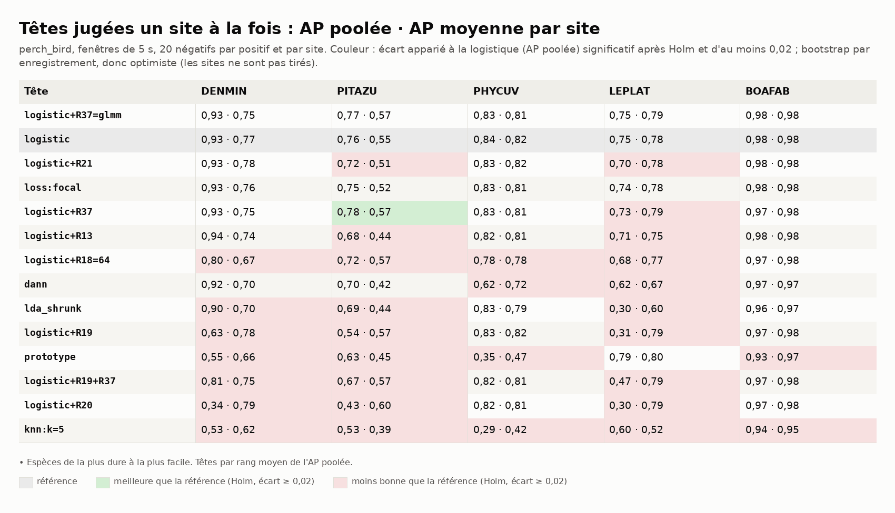
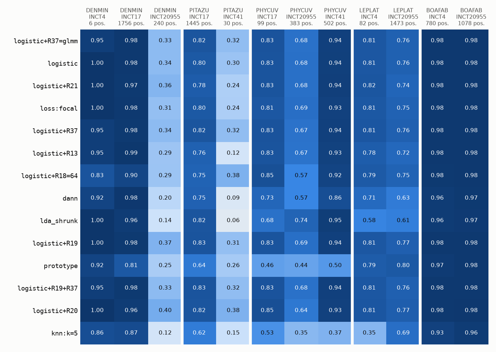
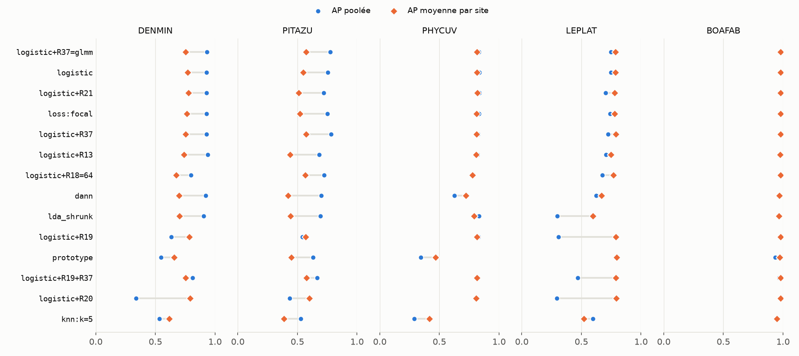
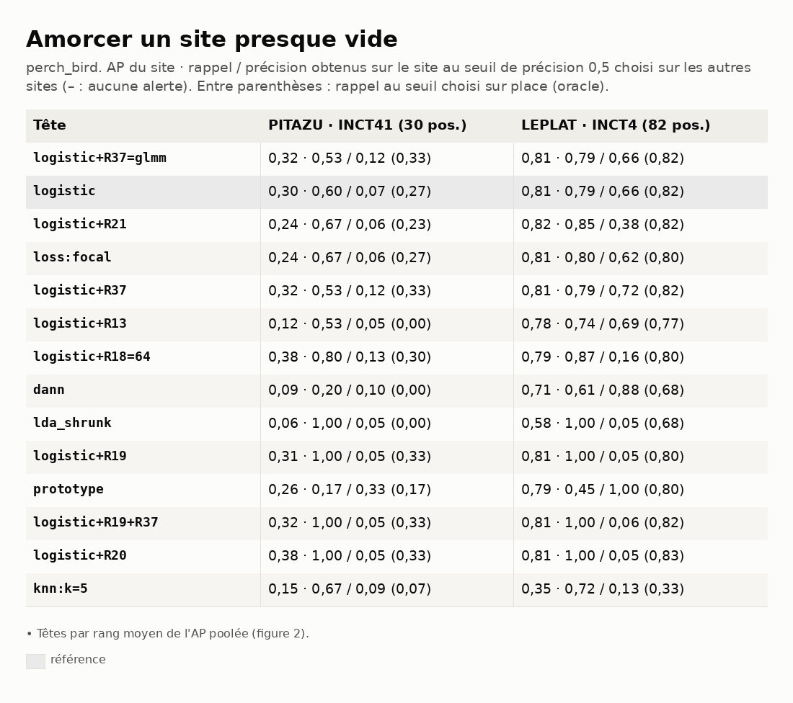

# Benchmark 03 — Têtes et régularisations sur AnuraSet, un site à la fois (perch_bird)

> **Note de l'audit du 10/10/2026 :** les p-valeurs de ce rapport sont calculées par amorçage
> avec 1 000 tirages, selon p = 2·k/n. Quand aucun tirage ne traverse 0, p vaut 0. Environ la
> moitié des comparaisons sont dans ce cas et sortent « significatives après Holm ». Avec le calcul
> corrigé, p = 2·(k+1)/(n+1) a un plancher, et plus aucune comparaison ne survivrait à Holm sur
> 115 à 245 comparaisons. Les intervalles de confiance restent valables. Lire « après Holm »
> comme « intervalle à 95 % qui exclut 0 », en attendant une relance avec plus de tirages.

29/09/2026 · commit `5980e92` · statut : **indicateur** (d'autres anoures qu'A. blanci ; 2 à 3
sites par espèce ; un seul tirage).

## En bref

- **perch_bird fait jeu égal avec perch_v2** : logistique, AP poolée 0,93 / 0,76 / 0,84 /
  0,75 / 0,98 (perch_v2 : 0,91 / 0,74 / 0,89 / 0,79 / 0,97) ; AP par site un peu plus haute
  sur DENMIN (0,77 contre 0,69) et PITAZU (0,55 contre 0,50). Écarts entre deux runs séparés,
  sans test apparié.
- **Même classement des têtes qu'avec perch_v2** : famille logistique en tête, R37=glmm au
  premier rang moyen ; kNN, prototype, R19, R20 en bas.
- **R37 sur PITAZU** : +0,025 d'AP poolée (Holm), meilleure sur ses deux sites (0,57 contre
  0,55 en moyenne) ; même sens qu'avec perch_v2, plus petit.
- **R19, R20 cassent l'AP poolée là où l'espèce est partout** (DENMIN 0,34 à 0,63 contre
  0,93 ; LEPLAT 0,30 contre 0,75) mais gardent l'AP par site : même mécanisme que dans le 01.
- **Amorçage** : LEPLAT à INCT4, le seuil choisi ailleurs tient (logistique : rappel 0,79,
  précision 0,66) ; PITAZU à INCT41, non (rappel 0,60 à précision 0,07).

## 1. Question

Sur le protocole du benchmark 01, perch_bird (Perch v1, EfficientNet, 1 280 dimensions)
vaut-il perch_v2 pour ces anoures, et le classement des têtes tient-il ?

## 2. Données

Mêmes enregistrements, espèces, fenêtres (5 s jointives, 19 166) et positives que le
benchmark 01 (n° 141).

*Figure 1 — Fenêtres positives de chaque espèce, par site.*

## 3. Pipeline et choix

Identiques au benchmark 01, sauf l'encodeur : perch_bird (bacpipe 1.3.5, TensorFlow CPU),
1 280 dimensions, 32 kHz. Amorçage : comme au benchmark 02 (`donnees/amorcage.csv`).

## 4. Résultats

*Figure 2 — AP poolée · AP moyenne par site. En couleur : écart à la logistique significatif
(Holm) et d'au moins 0,02.*

*Figure 3 — AP de chaque tête sur chaque site tenu à l'écart.*

*Figure 4 — Un grand écart entre les deux marqueurs signale des sites sur des échelles
différentes : R19, R20 sur DENMIN, PITAZU, LEPLAT.*

*Figure 5 — Sites presque vides : AP du site · rappel / précision au seuil choisi ailleurs
(rappel au seuil choisi sur place).*

Rappel à précision 0,5, seuil choisi sur les autres sites (seuil sur place) :

| Tête | DENMIN | PITAZU | PHYCUV | LEPLAT | BOAFAB |
|---|---|---|---|---|---|
| logistic | 0,93 (0,95) | **0,01** (0,82) | 0,86 (0,85) | 0,71 (0,76) | 0,99 (0,99) |
| logistic+R37 | 0,92 (0,95) | **0,01** (0,85) | 0,85 (0,84) | 0,75 (0,76) | 0,99 (0,99) |
| logistic+R19 | 0,41 (0,57) | 0,06 (0,77) | 0,84 (0,85) | 0,05 (0,04) | 0,98 (0,99) |

## 5. Hypothèses

1. **Deux Perch, même représentation utile.** Les deux sont appris sur Xeno-Canto (v2 y ajoute
   d'autres taxons) : pour des chants brefs et tonals, l'écart d'architecture pèse peu. Test :
   écart apparié perch_bird − perch_v2 sur les mêmes négatifs (un seul tirage commun).
2. **R19, R20** : comme au 01 (hypothèse 2) — le centrage par site retire le chant là où
   l'espèce occupe un quart à 40 % des fenêtres ; PHYCUV, rare, ne bouge pas (0,82 à 0,83).
3. **Amorçage.** LEPLAT à INCT4 : l'AP du site (0,81) est haute et les scores sont sur la même
   échelle que les autres sites, le seuil voyage. PITAZU à INCT41 : AP 0,30 ; les scores du
   fond d'INCT41 montent au-dessus du seuil appris sur INCT17 (245 alertes pour 30 positives).
   Le seuil voyage quand le site ressemble aux autres, pas autrement ; la prévalence et la
   ressemblance du fond sont les deux suspects.
4. **R18=64 et R20 sur PITAZU à INCT41** : AP du site 0,38 contre 0,30 ; même sens que l'ACP
   avec perch_v2 (0,42 contre 0,19) et protoclr sur LEPLAT/INCT4 : quand un site est presque
   vide, retirer des dimensions aide peut-être. Test : sur les données ONF, les sites hors
   Mataroni.

## 6. Ce qu'on en retient pour A. blanci

- perch_bird est un candidat au même niveau que perch_v2 sur ces anoures ; à départager sur
  les données ONF (le §2 du projet), où il est aussi 2,4 fois plus lent à encoder ici (TF CPU).
- Logistique et R37 restent les têtes à tester en premier, comme avec perch_v2.
- Un site neuf demandera son propre seuil sauf s'il ressemble aux sites d'apprentissage.

## 7. Limites

- Mêmes limites que le benchmark 01 ; comparaison à perch_v2 entre deux runs (tirages de
  négatifs indépendants par espèce), sans intervalle apparié.

## 8. Suites

1. Écart apparié entre encodeurs sur un tirage commun (hypothèse 1).
2. Les mêmes mesures d'amorçage sur les sites ONF hors Mataroni.

---

## Annexe — Reproduire

Comme le benchmark 02 (`anuraset/`), avec `perch_bird` et
`perch_bird-bacpipe1.3.5@o0`. Stock sur la branche `donnees-anuraset-perch_bird`. Durées (CPU,
4 cœurs) : encodage 88 min (3,7 fenêtres/s), têtes 8 à 16 min par espèce
(`donnees/durees_s.csv`).
