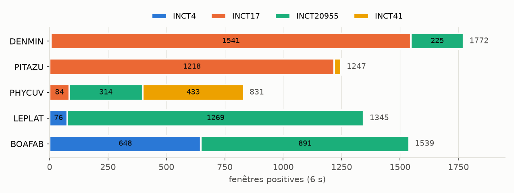
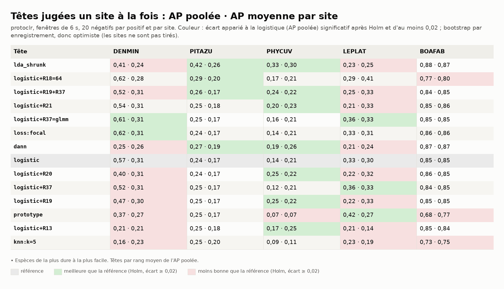
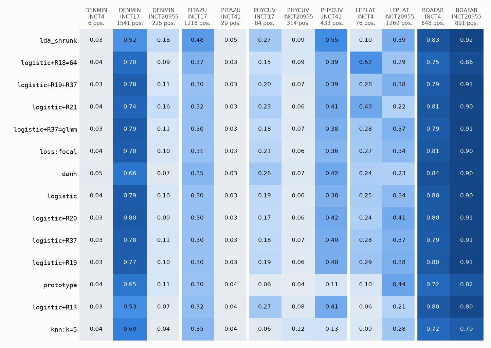
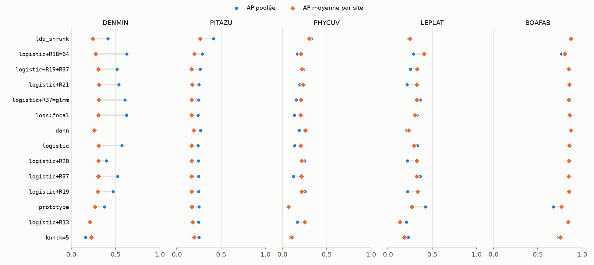
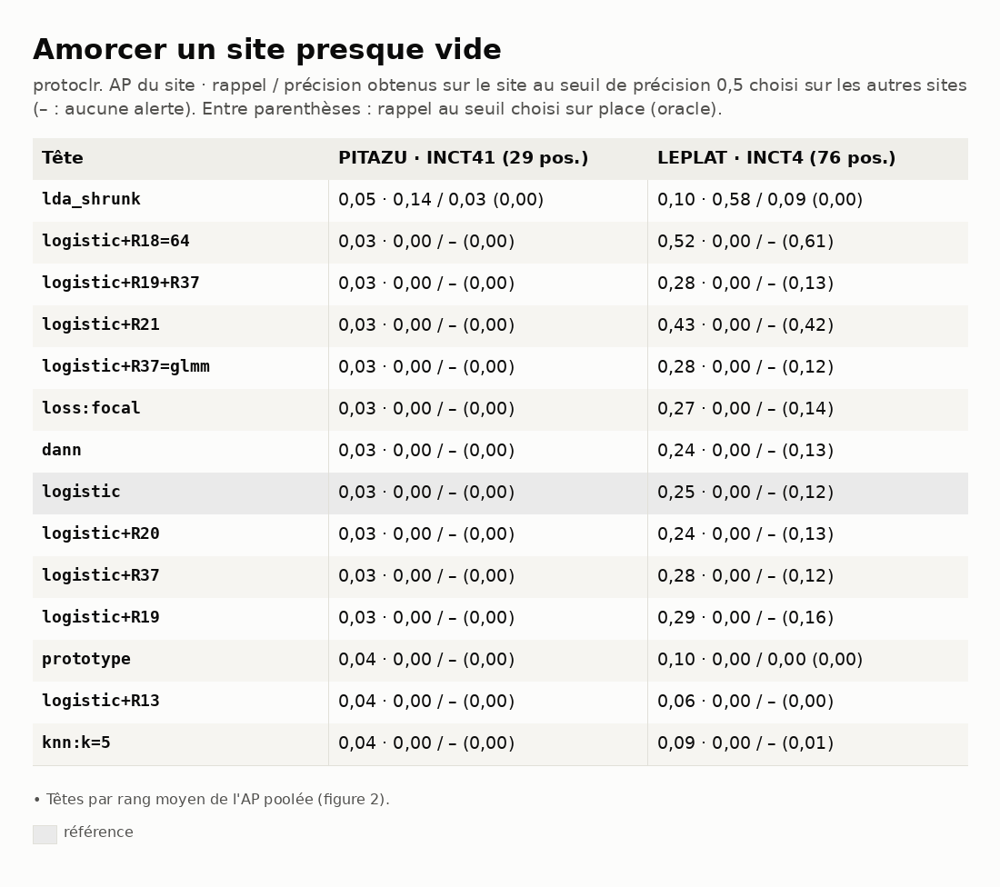

# Benchmark 02 — Têtes et régularisations sur AnuraSet, un site à la fois (protoclr)

29/09/2026 · commit `aef9603` · statut : **indicateur** (d'autres anoures qu'A. blanci ; 2 à 3
sites par espèce ; un seul tirage).

## En bref

- **protoclr sépare mal ces anoures** : logistique, AP poolée 0,14 à 0,57 sur 4 espèces sur 5
  (perch_v2 : 0,74 à 0,91, benchmark 01) ; seule BOAFAB reste haute (0,85 contre 0,97).
- **Le classement des têtes n'est pas celui de perch_v2** : la LDA régularisée (`lda_shrunk`)
  arrive en tête du rang moyen (+0,18 sur PITAZU et PHYCUV, Holm), mais perd 0,16 sur
  DENMIN et 0,10 sur LEPLAT. Aucune tête ne gagne partout.
- **Le seuil ne voyage pas, et sur place non plus** : rappel à précision 0,5 de la
  logistique nul sur PITAZU et LEPLAT, même au seuil choisi sur place (0,00).
- **Amorcer un site presque vide ne marche pas** : PITAZU à INCT41, AP ≤ 0,05 pour toutes les
  têtes (prévalence du site ≈ 0,05 : le hasard).
- Encodage 25 min (fenêtres de 6 s), têtes 7 à 11 min par espèce.

## 1. Question

Sur le protocole du benchmark 01, qu'apporte protoclr — petit encodeur (384 dimensions) appris
par apprentissage de prototypes sur des chants d'oiseaux — comme représentation, et le
classement des têtes tient-il d'un encodeur à l'autre ?

## 2. Données

Mêmes enregistrements que le benchmark 01 (1 599 : chants datés + fichiers sans espèce, aucun
drapeau QC écarté, n° 141), mêmes 5 espèces. **Fenêtres de 6 s** (fenêtre native de protoclr
dans bacpipe), jointives : 15 970 fenêtres au lieu de 19 166 ; les positives changent donc un
peu (figure 1 ; PITAZU à INCT41 : 29, LEPLAT à INCT4 : 76).



*Figure 1 — Fenêtres positives de chaque espèce, par site.*

## 3. Pipeline et choix

Identiques au benchmark 01 (tableau §3 de
`2026-09-28_anuraset_perch_v2/RAPPORT.md`) sauf :

| Étape | Choix | Pourquoi |
|---|---|---|
| Encodeur | protoclr (bacpipe 1.3.5, torch CPU), 384 dimensions, 16 kHz | encodeur léger du §2 |
| Fenêtres | 6 s jointives | fenêtre imposée par le modèle |
| Amorçage | par site : AP du site, rappel **et précision obtenue** au seuil de précision 0,5 choisi sur les scores hors-pli des autres sites | ce que verrait un site neuf sans annotation (`donnees/amorcage.csv`) |

## 4. Résultats



*Figure 2 — AP poolée · AP moyenne par site. En couleur : écart à la logistique significatif
(Holm) et d'au moins 0,02.*



*Figure 3 — AP de chaque tête sur chaque site tenu à l'écart.*



*Figure 4 — AP poolée contre AP moyenne par site.*



*Figure 5 — Sites presque vides : AP du site · rappel / précision au seuil choisi ailleurs
(rappel au seuil choisi sur place).*

Logistique, AP poolée, comparée au benchmark 01 :

| | DENMIN | PITAZU | PHYCUV | LEPLAT | BOAFAB |
|---|---|---|---|---|---|
| perch_v2 | 0,91 | 0,74 | 0,89 | 0,79 | 0,97 |
| protoclr | 0,57 | 0,24 | 0,14 | 0,33 | 0,85 |
| protoclr, meilleure tête | 0,62 (R18, focal) | 0,42 (LDA) | 0,33 (LDA) | 0,42 (prototype) | 0,88 (LDA) |

Rappel à précision 0,5 au seuil choisi sur les autres sites, logistique (seuil sur place) :
DENMIN 0,13 (0,51), PITAZU 0,00 (0,00), PHYCUV 0,12 (0,04), LEPLAT 0,00 (0,00), BOAFAB 0,87
(0,87).

## 5. Hypothèses

1. **Représentation.** protoclr, appris sur des oiseaux en 16 kHz, porte peu de ce qui
   distingue ces chants d'anoures du fond : même la meilleure tête reste sous 0,45 sur 3
   espèces. BOAFAB, saturée partout, ne départage pas. Test : sonde logistique sur plusieurs
   fenêtres par enregistrement (niveau enregistrement) pour voir si l'information est là mais
   diluée dans 6 s.
2. **LDA contre logistique.** Avec un signal faible, la LDA régularisée (covariance commune,
   rétrécie) estime moins de paramètres que la logistique sur 384 dimensions et se laisse
   moins tirer vers ce qui est propre aux sites d'apprentissage. Elle perd là où la logistique
   avait déjà un signal (DENMIN, LEPLAT). Test : même comparaison sur birdnet et perch_bird
   (benchmarks 03, 04).
3. **Seuil.** Quand l'AP d'un site est proche de sa prévalence, aucun seuil n'atteint 0,5 de
   précision, ni ailleurs ni sur place : l'amorçage échoue en amont du seuil.
4. **LEPLAT à INCT4, R18 (ACP à 64) : 0,52 d'AP du site** contre 0,25 pour la logistique ; un
   cas isolé sur 76 positives, le même sens que l'ACP sur PITAZU/INCT41 avec perch_v2
   (benchmark 01, hypothèse 4).

## 6. Ce qu'on en retient pour A. blanci

- protoclr ne semble pas un candidat pour la détection d'A. blanci au regard de perch_v2 ;
  indicateur sur d'autres espèces, à confirmer sur les données ONF si on veut l'écarter.
- Le classement des têtes dépend de l'encodeur : le juger sur l'encodeur retenu, pas sur
  perch_v2 seul.

## 7. Limites

- Mêmes limites que le benchmark 01 (autres espèces, 2 à 3 sites, bootstrap par enregistrement
  optimiste, un tirage de négatifs).
- Fenêtres de 6 s : grille et positives différentes de perch_v2 ; la comparaison des AP entre
  encodeurs mêle représentation et découpage.

## 8. Suites

1. Comparer les quatre encodeurs sur la même logistique (après birdnet et perch_bird).
2. Niveau enregistrement (hypothèse 1).

---

## Annexe — Reproduire

Scripts dans `documentation/benchmarks/outils_anuraset/` (encodage, une espèce par processus,
rassemblement) :

```
uv pip install --no-deps bacpipe==1.3.5   # puis les modules manquants, torch CPU
python documentation/benchmarks/outils_anuraset/encoder.py protoclr
for sp in DENMIN PITAZU PHYCUV LEPLAT BOAFAB; do OMP_NUM_THREADS=1 OPENBLAS_NUM_THREADS=1 \
  python documentation/benchmarks/outils_anuraset/bench.py protoclr-bacpipe1.3.5@o0 $sp sorties/ & done
python documentation/benchmarks/outils_anuraset/rassembler.py sorties/ \
  documentation/benchmarks/2026-09-29_anuraset_protoclr
uv run --group notebook python documentation/benchmarks/2026-09-29_anuraset_protoclr/generer.py
```

Réglages non par défaut : `regularization.R37.glmm_grid: [0.3, 1.0, 3.0]` (comme le 01).
Holm recalculé sur les 5 espèces ensemble au rassemblement. Stock sur la branche
`donnees-anuraset-protoclr`. Durées (CPU, 4 cœurs) : encodage 25 min (dont 9 de calcul, le
reste en lecture et rééchantillonnage), têtes 7 à 11 min par espèce (`donnees/durees_s.csv`).
