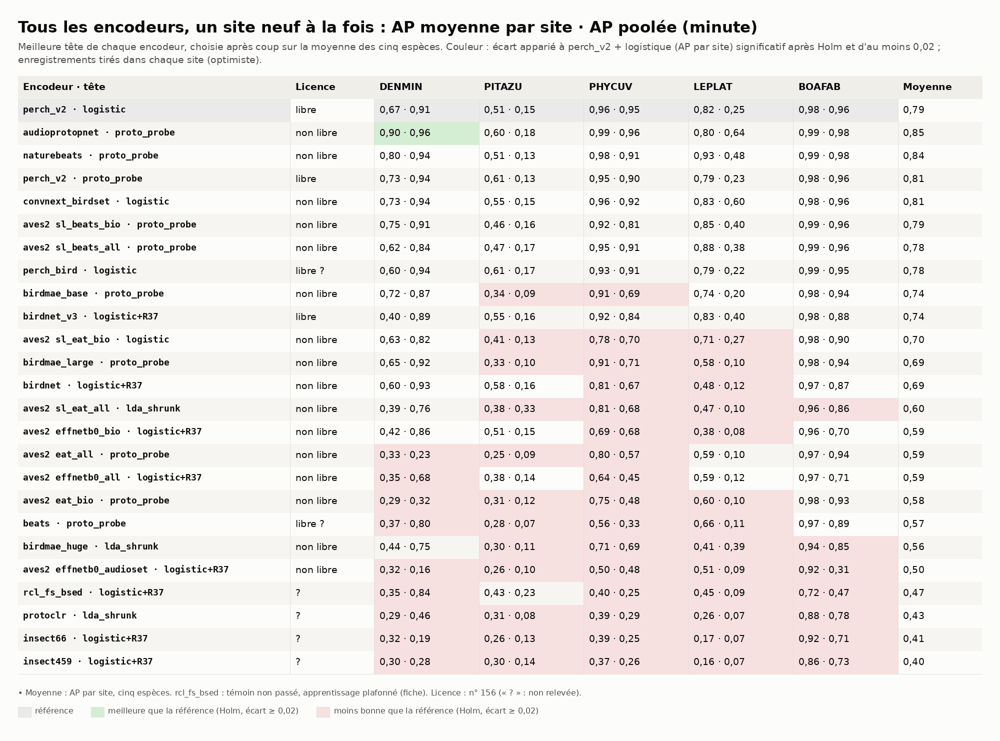
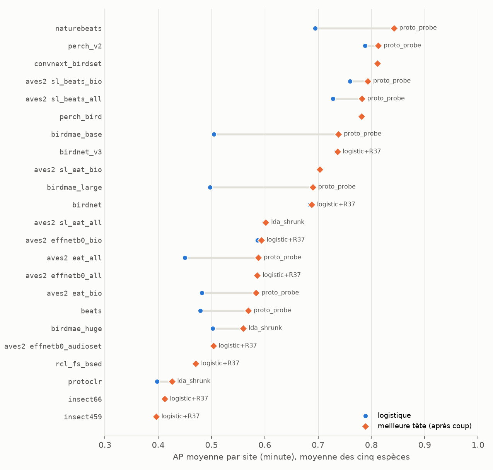
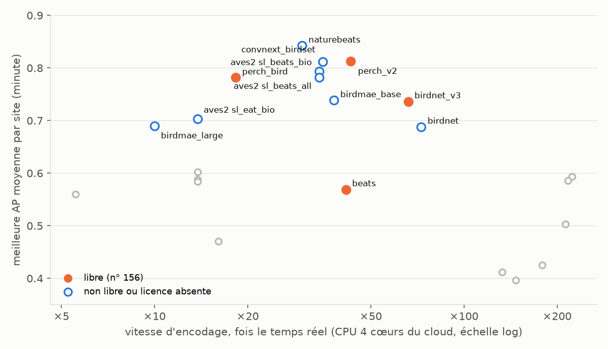
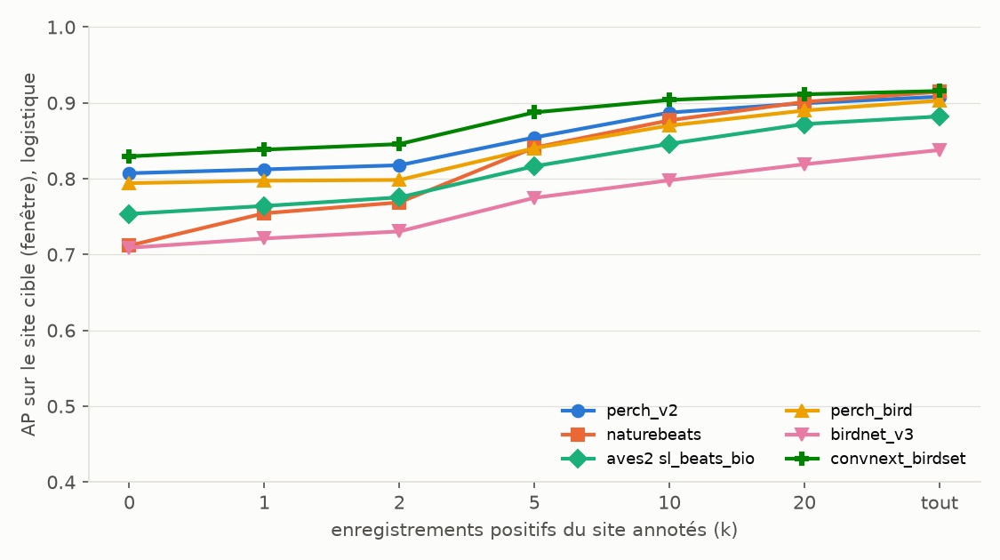

# Benchmark 08 — 23 encodeurs sur AnuraSet, chacun avec la tête qui lui correspond

30/09/2026 · commit `93d8f03` · statut : **indicateur**, pré-benchmark avant les données ONF
(anoures du Brésil, pas A. blanci ; 2 à 4 sites par espèce ; vague 2 incomplète).

## En bref

- **En tête, sans écart significatif entre eux** (AP moyenne par site, minute, cinq espèces) :
  - naturebeats + sonde à prototypes : **0,84** ;
  - perch_v2 + sonde à prototypes : **0,81** ;
  - convnext_birdset + logistique : **0,81** (ajouté le 30/09 au soir) ;
  - perch_v2 + logistique (la référence) : 0,79 ;
  - aves2 sl_beats_bio : 0,79 ;
  - perch_bird : 0,78.

  Après Holm, aucun autre encodeur ne bat la référence. Sans les deux sites presque vides,
  naturebeats reste devant (0,88), suivi de convnext_birdset (0,87).
- **La règle du n° 151 a tout changé** pour les transformers auto-supervisés. La sonde à
  prototypes sur les jetons bat la logistique sur les cinq espèces pour 7 des 10 transformers
  (eat_all : 4 sur 5) : Bird-MAE-Base passe de 0,51 à 0,74, naturebeats de 0,69 à 0,84. Elle
  n'aide pas les EAT affinés sur étiquettes (sl_eat), ni guère perch_v2 (2 espèces sur 5,
  +0,03 en moyenne). La sonde attentive n'aide presque jamais.
- **Meilleur libre** (n° 156) : perch_v2 + sonde à prototypes (0,81). Aucun non libre ne le bat
  sur une espèce après Holm (`comparaisons_meilleur_libre.csv`), ni naturebeats (licence non
  commerciale), ni convnext_birdset (aucune licence déclarée).
- **Site sans aucune annotation** (courbe d'amorçage, logistique) : convnext_birdset est le
  meilleur (0,83), devant perch_v2 (0,81) ; naturebeats part de 0,71 et ne rejoint perch_v2
  que vers 20 enregistrements annotés. convnext_birdset reste devant à tout k.
- **BirdNET 3 ne « pète pas tous les scores » ici.** Il obtient 0,74, mieux que BirdNET 2.4
  (0,69) sur les chants longs, mais sous perch_v2. Son classifieur, sans aucun entraînement,
  égale la logistique sur BOAFAB (0,99) et bat même la logistique de BirdNET 3 sur DENMIN.
- **Le critère de proximité de taxon tient pour les encodeurs lointains** : les deux modèles
  d'insectes (0,40 et 0,41) et rcl_fs_bsed (0,47) finissent derniers. L'audio général seul fait
  moins bien que la bioacoustique (EfficientNet AudioSet 0,50 contre 0,59).

## 1. Question

Parmi les encodeurs retenus le 29/09, chacun jugé avec la tête qui correspond à sa sortie
(n° 151), lesquels passent au benchmark ONF ? Le meilleur libre y passe, plus au plus deux non
libres, et seulement s'ils font mieux que lui (n° 156).

## 2. Données

Mêmes enregistrements, espèces, sites et positifs que les benchmarks 01 à 07 (n° 141).

- **23 encodeurs à cinq espèces complètes** : les six du benchmark 07, puis la vague 2
  (sessions 5 à 8, 10 à 14 ; fiches dans `../fiches/`). convnext_birdset (session 8) a été
  ajouté le 30/09 au soir.
- **Manquent** : audioprotopnet (session 8, en cours), avesecho_passt et biolingual (session 9,
  relancée le 30/09) : à ajouter quand elles auront fini (Annexe) ; MetaPerch, seulement annoncé
  (article de juillet 2026 ; poids pas encore publiés au 30/09).
- **naturelm-audio-v1-beats** d'esp-aves2 a les mêmes poids que naturebeats (cosinus 1,0000) :
  il n'est compté qu'une fois.

## 3. Pipeline et choix

| Étape | Choix | Pourquoi |
|---|---|---|
| Plis, apprentissage, évaluation | protocole 07 : un site tenu à l'écart ; toutes ses fenêtres jugées | n° 150 ; un site neuf, prévalence réelle |
| Unité | minute (score = max des fenêtres de l'enregistrement), fenêtre en complément | grilles de 0,2 à 6 s : seule unité commune ; apparié |
| Têtes, embedding | logistique, logistique + R37=glmm, LDA rétrécie, prototype simple | protocole 07 ; le prototype simple est la tête d'origine de protoclr et de rcl_fs_bsed |
| Têtes sur jetons | attentive, logistique sur le maximum, sonde à prototypes (`proto_probe`) | n° 151, 152 : un transformer se juge sur ses jetons ; perch_v2 aussi, pour une comparaison équitable |
| Classifieur d'origine | birdnet_v3 sans entraînement, 4 espèces | n° 152 |
| Meilleure tête | la meilleure moyenne sur les cinq espèces, **choisie après coup** | biais du gagnant : voir « Limites » |
| Comparaisons | AP moyenne par site contre perch_v2 + logistique, fixée d'avance ; et contre le meilleur libre ; bootstrap apparié (enregistrements tirés dans chaque site), Holm | n° 139, 156 ; intervalle optimiste (sites non tirés) |
| Témoin | BOAFAB ≥ 0,85 en logistique | n° 151 : rcl_fs_bsed ne le passe pas (0,72) |

## 4. Résultats



*Figure 1 — Meilleure tête de chaque encodeur : AP moyenne par site · AP poolée (minute).
Rouge : moins bonne que la référence (Holm, écart ≥ 0,02). Aucune case verte.*



*Figure 2 — De la logistique à la meilleure tête : +0,09 à +0,23 pour les transformers
auto-supervisés, +0,03 à +0,05 pour les BEATs affinés d'esp-aves2, presque rien pour les CNN
supervisés.*



*Figure 3 — Plein : libre (n° 156). Le meilleur libre, perch_v2, encode 43 fois plus vite que
le temps réel ; convnext_birdset, 35 fois ; naturebeats, 30 fois.*



*Figure 4 — Site neuf, k enregistrements positifs annotés (logistique seule : les têtes sur
jetons ne sont pas dans la courbe). convnext_birdset mène à tout k ; perch_v2 devance naturebeats
jusqu'à k = 10.*

Contre le meilleur libre (perch_v2 + sonde à prototypes), écart d'AP moyenne par site
(minute) ; aucun ne survit à Holm :

| Non libre (meilleure tête) | DENMIN | PITAZU | PHYCUV | LEPLAT | BOAFAB |
|---|---|---|---|---|---|
| naturebeats · proto_probe | +0,07 | −0,10 | +0,03 | +0,14 | +0,00 |
| aves2 sl_beats_bio · proto_probe | +0,01 | −0,15 | −0,03 | +0,06 | +0,01 |
| aves2 sl_beats_all · proto_probe | −0,11 | −0,14 | −0,01 | +0,10 | +0,01 |
| convnext_birdset · logistic | −0,00 | −0,06 | +0,01 | +0,04 | −0,00 |

Robustesse : sans les sites à moins de 10 minutes positives (DENMIN à INCT4, 2 ; PITAZU à
INCT41, 9), l'ordre reste proche : naturebeats 0,88, convnext_birdset 0,87, perch_bird 0,87,
aves2 sl_beats 0,85, perch_v2 + prototypes 0,85 (en logistique, 0,84), birdnet_v3 0,83.

## 5. Hypothèses

1. **Pourquoi la sonde à prototypes marche.** Une note occupe quelques jetons ; le maximum sur
   les jetons ne la dilue pas dans le fond, alors que la moyenne le fait. Les transformers
   auto-supervisés gardent le détail local dans leurs jetons, mais leur embedding moyen est
   dominé par le fond : le jeton de classe d'eat_all a un cosinus de 0,99 d'une fenêtre à
   l'autre. Test : sur A. blanci (notes de 0,1 s), l'écart devrait grandir.
2. **Pourquoi l'attentive échoue.** Une seule requête, apprise sur peu de positifs, peut se
   caler sur un indice de site plutôt que sur la note. Test : l'attentive avec R45 (jetons
   masqués au hasard) ou plusieurs requêtes.
3. **naturebeats contre beats** (0,84 contre 0,57, même réseau) : l'affinage bioacoustique de
   NatureLM-audio fait la différence. Ses données d'entraînement ne sont pas vérifiées, et
   AnuraSet pourrait en faire partie : ce serait une fuite.
4. **bio contre all** (esp-aves2) : aucun avantage à ajouter AudioSet pour ces anoures
   (sl_beats 0,79 contre 0,78 ; EfficientNet 0,59 contre 0,59), contrairement à l'article. Test
   sur les données ONF.
5. **Plus gros n'est pas meilleur** : Bird-MAE Base 0,74, Large 0,69, Huge 0,56 (sans jetons),
   comme dans la revue comparative.
6. **convnext_birdset, un CNN supervisé sur BirdSet, se transfère le mieux d'un site à l'autre**
   : meilleur départ sans annotation, et l'AP poolée la plus haute sur LEPLAT (0,60 contre 0,25
   pour perch_v2). Ses scores se comparent d'un site à l'autre ; hypothèse : l'entraînement sur
   des enregistrements continus (BirdSet), plus proches de nos paysages sonores que les extraits
   centrés de Xeno-canto. Test : la même lecture sur les sites ONF.

## 6. Ce qu'on en retient pour A. blanci

- **Encodeur libre : perch_v2**, avec la sonde à prototypes sur ses jetons spatiaux comme
  candidate face à la logistique. L'écart est faible ici (+0,03), mais A. blanci émet des notes
  plus brèves encore (hypothèse 1).
- **Non libres pour le benchmark ONF** (au plus deux, n° 156) : aucun ne bat le meilleur libre
  après Holm. À proposer quand même, parce qu'ils sont au même niveau : naturebeats + sonde à
  prototypes (meilleure moyenne), et convnext_birdset + logistique (meilleur départ sans
  annotation, simple, sans jetons). Pour convnext_birdset, demander sa licence au laboratoire
  DBD : s'il en publie une libre, il change de camp. À décider avec Élodie.
- **Site neuf, pas encore annoté** : convnext_birdset part le mieux (0,83), perch_v2 + logistique
  juste derrière (0,81), premier des libres.
- **La sonde à prototypes entre dans les têtes de référence**, pour tout encodeur à jetons.

## 7. Limites

- **Meilleure tête choisie après coup** parmi 3 à 7 têtes selon l'encodeur. Garde-fou : la sonde
  à prototypes gagne sur les cinq espèces pour 7 transformers sur 10 ; ce n'est pas un gagnant
  de hasard.
- **Têtes sur jetons en transfert seulement**, pas dans la courbe d'amorçage.
- **Vague 2 incomplète** (sessions 8 et 9). rcl_fs_bsed : apprentissage plafonné à 60 000
  fenêtres et témoin non passé.
- **Bootstrap optimiste** (2 à 4 sites) ; 23 encodeurs × 5 espèces comparés, Holm.
- **Fuite possible** pour birdnet_v3 et naturebeats : leurs données d'entraînement ne sont pas
  publiées.

## 8. Suites

1. Ajouter audioprotopnet (sa tête d'origine est à prototypes), avesecho_passt et biolingual
   quand les sessions 8 et 9 auront fini, avant la clôture de la vague 2 le 09/10.
2. Ajouter les têtes sur jetons à la courbe d'amorçage, pour perch_v2 et naturebeats.
3. Benchmark ONF (après le go du n° 158) : perch_v2 (logistique et sonde à prototypes),
   birdnet_v3, et les deux non libres ci-dessus si Élodie les accepte.

---

## Annexe — Reproduire

Sorties brutes : branche `resultats-anuraset-07`, dossier `resultats/global/` (perch_v2 avec
jetons : refait ici, `global_bench.py perch_v2 <ESPECE> sorties --tokens`, jetons par
`jetons.py perch_v2`, 45 min).

```
uv run python anuraset/rassembler_08.py <sorties> documentation/benchmarks/2026-09-30_anuraset_encodeurs
uv run --group notebook python documentation/benchmarks/2026-09-30_anuraset_encodeurs/generer.py
```

`donnees/encodeurs.csv` : fenêtre, dimension, débit et licence de chaque encodeur, relevés
dans les fiches et les n° 141 à 156.

**Ajouter les sessions 8 et 9** (audioprotopnet, avesecho_passt, biolingual ; convnext_birdset : fait)
quand leurs sorties seront sur `resultats-anuraset-07` : reporter leur débit (fiche) dans
`donnees/encodeurs.csv`, puis

```
git fetch origin resultats-anuraset-07
mkdir -p /tmp/g08 && git archive origin/resultats-anuraset-07 resultats/global | tar -x -C /tmp/g08
uv run python anuraset/rassembler_08.py /tmp/g08/resultats/global documentation/benchmarks/2026-09-30_anuraset_encodeurs
uv run --group notebook python documentation/benchmarks/2026-09-30_anuraset_encodeurs/generer.py
```

La branche porte déjà perch_v2 avec ses têtes sur jetons. Le rassemblement trouve seul les
nouveaux encodeurs ; les chiffres du texte et le n° 161 sont à revoir ensuite.
